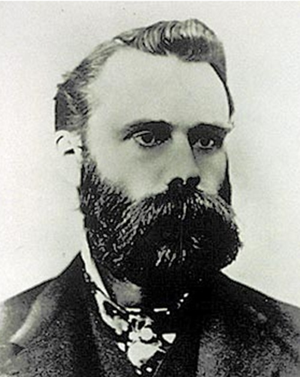
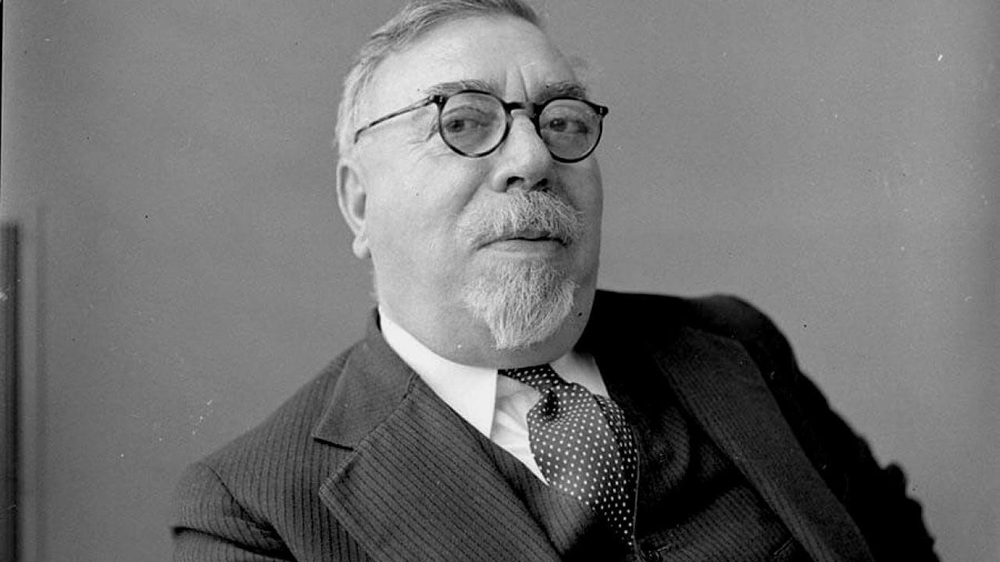
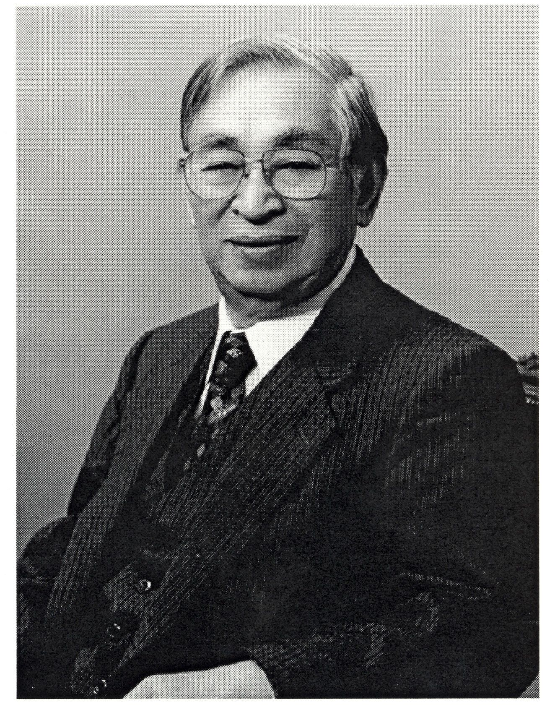

# Introduction

The history of mathematical analysis has traditionally been dominated by the study of smooth, deterministic functions, where the infinitesimal calculus of Newton and Leibniz provides the appropriate framework to describe the evolution of dynamical systems. However, nature presents numerous phenomena where irregularity and randomness are not mere perturbations, but rather the fundamental characteristics of the system. This work focuses on the study of Stochastic Calculus, a branch of mathematics designed to model processes that evolve continuously but are nowhere differentiable, and its fundamental application to financial asset pricing theory.

## Historical Background and Physical Motivation

The birth of stochastic calculus is non-linear. It is the result of a convergence between biology, statistical physics, and the burgeoning financial mathematics of that era.

### The Botanist Robert Brown

The starting point dates back to 1827. The Scottish botanist Robert Brown (1773–1858), interested in plant fertilisation, observed pollen grains suspended in water through a microscope that was rudimentary by today's standards. Brown noticed that the microscopic particles ejected by the grains exhibited a continuous, chaotic motion, apparently devoid of any external cause or action.

Initially, the predominant hypothesis was vitalistic: it was assumed that this movement was a manifestation of the "vital force" of organic matter, similar to that of spermatozoa. However, in search of scientific rigour, Brown applied his experiments to inorganic matter. He tested glass dust, rocks from all geological eras, and even a fragment from the Egyptian Sphinx, observing the exact same behaviour in every case.

{#fig-brown width=50%}

Brown established three fundamental empirical facts: the motion is incessant (it does not stop due to friction), it is irregular (the trajectories lack observable smooth tangents), and it is universal for microscopic particles suspended in a fluid. Although Brown could not provide a physical theory, his observation posed a direct challenge to classical thermodynamics: if the motion never ceases, is the second law of thermodynamics being violated by extracting infinite energy from the medium?

### The Financier Louis Bachelier

Surprisingly, the first attempt at a rigorous mathematical formalisation of this phenomenon did not emerge from physics laboratories, but from the study of capital markets. In 1900, five years before Einstein's *annus mirabilis*, the French mathematician Louis Bachelier defended his doctoral thesis entitled *Théorie de la spéculation* (Theory of Speculation) under the supervision of Henri Poincaré.

Bachelier aimed to model the dynamics of option prices on the Paris Bourse. His fundamental intuition was to assume that, although the future price is uncertain, the probability of its changes follows strict laws. He asserted that the market is a fair game, implicitly introducing the concept of a martingale, which states that the best prediction of a future price, given current information, is the current price itself.

{#fig-bachelier width=30%}

Mathematically, Bachelier assumed that price increments across disjoint time intervals were stochastically independent and stationary. Denoting by $p(x, t)$ the probability density of the price changing by an amount $x$ over a time interval $t$, Bachelier derived the Chapman-Kolmogorov equation decades before Kolmogorov formalised it:

$$
p(x, t_1 + t_2) = \int_{-\infty}^{\infty} p(x-y, t_1) p(y, t_2) \, dy
$$

From this relation, Bachelier deduced that the distribution of prices must be normal (Gaussian) and that price variance increased linearly with time. Unfortunately, his work was considered too applied for mathematicians and too theoretical for economists, remaining in obscurity until it was rediscovered by Paul Samuelson and other economists in the 1950s.

### The Physicists Einstein and Smoluchowski

In 1905, Albert Einstein published one of his most influential papers, *Über die von der molekularkinetischen Theorie der Wärme geforderte Bewegung von in ruhenden Flüssigkeiten suspendierten Teilchen* (On the Movement of Small Particles Suspended in a Stationary Liquid Required by the Molecular-Kinetic Theory of Heat). This work provided the definitive physical explanation of Brownian motion and, consequently, irrefutable evidence for the existence of atoms.

His reasoning combined hydrodynamics with kinetic theory. He considered a suspended particle subjected to two opposing forces: a viscous friction force opposing the motion, given by Stokes' law, and a fluctuating force caused by the random collisions of fluid molecules against the particle.

Einstein argued that, in thermal equilibrium, these forces must balance statistically, thereby deriving the diffusion equation:

$$
\frac{\partial f}{\partial t} = D \frac{\partial^2 f}{\partial x^2}
$$

where $D$ is the diffusion coefficient. The solution to this equation is a Gaussian distribution whose variance is given by $\sigma^2(t) = 2Dt$.

Einstein's crucial contribution was connecting this coefficient $D$ with measurable physical constants, demonstrating that the mean squared displacement is proportional to time (and its root-mean-square to the square root of time). Shortly after, in 1906, the Polish physicist Marian Smoluchowski (1872–1917) independently developed a similar theory using a *random walk* approach, providing a conceptual bridge between the discrete molecular world and the continuum. Einstein's predictions were empirically verified in 1908 by the French physicist Jean Perrin (1870–1942), an achievement that earned Perrin the Nobel Prize in Physics in 1926.

### The Mathematician Norbert Wiener

Despite its physical success, Brownian motion still lacked a rigorous mathematical foundation. Physicists described it as a limit of random walks, but did a well-defined mathematical object representing this phenomenon actually exist?

{#fig-wiener width=50%}

In 1923, the American mathematician Norbert Wiener (1894–1964) made groundbreaking contributions to probability theory by constructing Wiener spaces. Rather than defining the process as a mere collection of random variables, Wiener defined a probability measure $\mu$ over the functional space $C_0([0, \infty))$, which represents the space of all continuous functions starting at the origin.

To achieve this, Wiener utilized the definition of finite-dimensional cylinder sets. He specified that the measure of the set of trajectories passing through specific intervals at finite times $t_1, \dots, t_n$ must coincide with the joint Gaussian distribution previously derived by Einstein and Bachelier. Based on this framework, he proved the existence of Brownian motion as a rigorous, mathematically well-defined object.

### The Stochastic Calculus of Kiyosi Itô

Once the mathematical existence of the Brownian process was guaranteed, a new question arose: how can we model dynamical systems affected by this Brownian motion or noise?

In physics and engineering, it is common to express the evolution of a system $X_t$ via a differential equation of the form:

$$
\frac{dX_t}{dt} = a(t, X_t) + b(t, X_t) \xi_t
$$

where $a$ is a deterministic drift, $b$ is the noise intensity, and $\xi_t$ represents white noise (the derivative of Brownian motion). However, as Wiener demonstrated, Brownian motion $B_t$ is nowhere differentiable; thus, $\xi_t = dB_t/dt$ does not exist as an ordinary function.

To give meaning to these equations, it was necessary to rewrite them in integral form:

$$
X_t = X_0 + \int_0^t a(s, X_s) \, ds + \int_0^t b(s, X_s) \, dB_s
$$

The first term is an ordinary Riemann integral. The second term, however, presents severe difficulties for classical methods. Since the trajectories of $B_t$ are of unbounded variation, the classical Riemann-Stieltjes integral $\int \phi \, dB$ is not well-defined.

In two seminal papers published in 1944 and 1951, the Japanese mathematician Kiyosi Itô (1915–2008) proposed a completely new theory of integration. In classical calculus, the choice of the evaluation point within the Riemann sums does not affect the limit for smooth integrands. Itô observed that the extreme oscillation of the Brownian paths caused the limit to depend crucially on this choice.

{#fig-ito width=50%}

Itô defined his integral by always evaluating the integrand at the left endpoint of each partition subinterval. This choice, though seemingly minor, preserves the martingale property discussed earlier. This new definition of integration gave rise to a revolutionary framework for calculus. The most famous result of this theory is Itô's Lemma, the stochastic analogue of the chain rule and the Fundamental Theorem of Calculus. 

This formula demonstrates that when operating with functions of Brownian processes, the standard rules of differentiation must be corrected by second-order terms derived from quadratic variation. This correction is not a mere technical detail; it represents the accumulation of risk or volatility and is the core component that drives financial models such as Black-Scholes, where volatility systematically dampens long-term geometric returns.

# Brownian Motion

To begin developing an intuition about Brownian motion, it is highly useful to start by studying its discrete cousin: the *random walk*. 

This approach allows us to visualize it as the limit of a discrete process when both the spatial and temporal steps of this random walk tend to zero—a procedure known as the *scaling limit*.

## The Simple Random Walk

Let us consider a particle moving along a one-dimensional lattice (akin to a ruler extending infinitely in both directions from zero). Starting from the position $x=0$ at time $t=0$, at each time interval $\Delta t$, the particle takes a step of size $\Delta x$ either to the right or to the left with equal probability.

Mathematically, we define a sequence of independent and identically distributed (i.i.d.) random variables, denoted by $\{X_i\}_{i=1}^{\infty}$, such that:

$$
P(X_i = 1) = \frac{1}{2} \quad P(X_i = -1) = \frac{1}{2}
$$

The position of the particle after $n$ steps is described by the partial sum:

$$
S_n = \sum_{i=1}^{n} X_i \quad S_0 = 0
$$

To transition towards the continuous process, we denote the position of the particle at time $t_n = n\Delta t$ as $Y(t_n)$, which yields:

$$
Y(t_n) = \Delta x \cdot S_n = \Delta x \sum_{i=1}^{n} X_i
$$

The total displacement is obtained by multiplying the step size by the net number of steps in the positive or negative direction. Thanks to the independence of the steps, we have:

- **Expectation:** $E[Y(t_n)] = \Delta x \sum E[X_i] = 0$. On average, the particle does not move from the origin.
- **Variance:** Knowing that $Var(X_i) = E[X_i^2] - (E[X_i])^2 = 1 - 0 = 1$, the variance of the position is $Var(Y(t_n)) = (\Delta x)^2 \sum_{i=1}^{n} Var(X_i) = n (\Delta x)^2$. As time passes, uncertainty regarding the particle's position increases.

{#fig-random-walk}

## Passing to the Limit or *Scaling Limit*

Our goal now is to make both the step size and the time interval increasingly smaller; that is, taking $\Delta t \to 0$ and $\Delta x \to 0$. Suppose we wish to evaluate the particle's position at a fixed time $t$. Given that total time is the number of steps multiplied by the duration of each step, the number of steps required to reach time $t$ is $n = t / \Delta t$.

Substituting $n$ into the variance expression obtained earlier:

$$
Var(Y(t)) = \frac{t}{\Delta t} (\Delta x)^2 = t \cdot \frac{(\Delta x)^2}{\Delta t}
$$

Here, a fundamental obstacle appears when constructing Brownian motion. If we let $\Delta t$ and $\Delta x$ tend to zero independently, the variance could either explode to infinity or vanish to zero. To obtain a non-trivial, physically meaningful limit—where the particle diffuses but neither disappears nor jumps to infinity—we must impose that the ratio between the squared step size and the time step remains constant.

Thus, we require the existence of a diffusion constant $D$ (precisely the one seen in Einstein's diffusion equation, typically normalized to $D=1$) such that:

$$
\frac{(\Delta x)^2}{\Delta t} \longrightarrow 1 \quad \text{or equivalently} \quad \Delta x \approx \sqrt{\Delta t}
$$

Under this diffusive scaling ($\Delta x = \sqrt{\Delta t}$), we study the convergence of the distribution of $Y(t)$ as $n \to \infty$ (which implies $\Delta t \to 0$). Applying the Central Limit Theorem to the sum of the i.i.d. variables $X_i$:

$$
\frac{S_n}{\sqrt{n}} \xrightarrow{d} N(0,1)
$$

Rewriting our position $Y(t)$ in terms of this limit:

$$
Y(t) = \Delta x \cdot S_n = \sqrt{\Delta t} \cdot S_{t/\Delta t} = \sqrt{\frac{t}{n}} \cdot S_n = \sqrt{t} \left( \frac{S_n}{\sqrt{n}} \right)
$$

As $n \to \infty$, the term inside the parentheses converges in distribution to a standard normal $N(0,1)$. Therefore, in the continuous limit, the position of the particle $W(t)$ is distributed as:

$$
W(t) \sim \sqrt{t} \cdot N(0,1) \sim N(0, t)
$$

This argument reveals the two fundamental characteristics that we will define axiomatically in the following section: the increments of this process are Gaussian, and its variance grows linearly with time ($Var(W(t)) = t$).

Furthermore, as Evans points out, this passage to the limit directly connects probability with partial differential equations: the probability density function of this limiting particle satisfies the heat or diffusion equation:

$$
\frac{\partial p}{\partial t} = \frac{1}{2} \frac{\partial^2 p}{\partial x^2}
$$

{#fig-brownian-python}

## Axiomatic Definition of Brownian Motion

### Probability Spaces and Filtrations

To define any stochastic process, we require a mathematical framework where random events occur. This framework is our probability space $(\Omega, \mathcal{F}, P)$. In our context, $\Omega$ represents the set of all possible paths a particle can take, and each $\omega \in \Omega$ represents one specific trajectory. $P$ is the probability measure that dictates how likely a set of these trajectories is to occur.

Moreover, when studying processes that evolve over time, the concept of *filtration*, usually denoted as $\{\mathcal{F}_t\}_{t \geq 0}$, is paramount. It represents the accumulated information up to time $t$. We say that the process $W(t)$ is *adapted* to the filtration if its value at time $t$ is known given the information $\mathcal{F}_t$.

### The 4 Axioms

A stochastic process $W(t)$ with $t \geq 0$ is a standard one-dimensional Brownian Motion (or Wiener Process) if it satisfies the following conditions:

1. **Start at the origin:**
   $$
   W(0) = 0 \quad \text{almost surely (with probability 1)}.
   $$
2. **Independent Increments:**
   For any set of times $0 \leq t_1 < t_2 < \dots < t_n$, the random variables representing displacements in disjoint intervals:
   $$
   W(t_2) - W(t_1), \quad W(t_3) - W(t_2), \quad \dots, \quad W(t_n) - W(t_{n-1})
   $$
   are stochastically independent. That is, the particle's behavior in a future interval $(t_2, t_3)$ does not depend on how far or in what direction it moved during a past interval $(t_1, t_2)$.
3. **Stationary Gaussian Increments:**
   For any $0 \leq s < t$, the increment $W(t) - W(s)$ follows a Normal distribution with zero mean and variance equal to the length of the interval:
   $$
   W(t) - W(s) \sim N(0, t-s)
   $$
   In other words, whether we examine the interval from 0 to 1 second or from 100 to 101 seconds, if the duration is the same, the probability distribution of the displacement remains identical.
4. **Continuity of Paths:**
   For almost all $\omega \in \Omega$, the function $t \mapsto W(t, \omega)$ is continuous. Although the motion is highly erratic, the particle traces a continuous path without discrete jumps.

### Characterization via Covariance

Often, verifying the four preceding axioms directly can be complex. An alternative and highly powerful method to define a Gaussian process—where any linear combination of its values is normally distributed—is through its mean and covariance function.

Brownian motion is the unique zero-mean Gaussian process with the following covariance function:

$$
E[W(t)W(s)] = \min(t, s)
$$

**Proof:**
Assume Without Loss of Generality (WLOG) that $s < t$. We wish to calculate the expectation of the product of the positions at these two times. We use a fundamental algebraic trick in stochastic calculus: rewriting $W(t)$ based on $W(s)$ and the subsequent increment.

$$
\begin{aligned}
E[W(t)W(s)] &= E\Big[ \big( (W(t) - W(s)) + W(s) \big) \cdot W(s) \Big] \\
&= E\Big[ (W(t) - W(s))W(s) + W(s)^2 \Big] \\
&= E \Big[ (W(t) - W(s))W(s) \Big] + E\Big[ W(s)^2 \Big]
\end{aligned}
$$

To evaluate the first term formally, we use the Law of Total Expectation, conditioning on the filtration $\mathcal{F}_s$. Since $W(s)$ is $\mathcal{F}_s$-measurable, it acts as a constant with respect to this conditional expectation. Furthermore, the future increment $(W(t) - W(s))$ is independent of $\mathcal{F}_s$ and has zero mean:

$$
\begin{aligned}
E \Big[ (W(t) - W(s))W(s) \Big] &= E \bigg[ E \Big[ (W(t) - W(s))W(s) \mid \mathcal{F}_s \Big] \bigg] \\
&= E \bigg[ W(s) \cdot E \Big[ (W(t) - W(s)) \mid \mathcal{F}_s \Big] \bigg] \\
&= E \Big[ W(s) \cdot 0 \Big] = 0
\end{aligned}
$$

On the other hand, we know that $E[W(s)^2] = Var(W(s)) = s$, since the variance equals the time elapsed up to $s$. Summing both results, we obtain:

$$
E[W(t)W(s)] = 0 + s = \min(t, s)
$$

Essentially, this formula indicates that the closer two points in time are, the more highly correlated the particle's positions will be.

## Existence and Construction

We have defined the properties a Brownian motion should possess (the axioms), but this does not guarantee that a mathematical object fulfilling them actually exists.

There are several ways to prove the existence of Brownian motion (Kolmogorov Consistency Theorem, Donsker's Theorem...), but perhaps the most visual one is the Lévy-Ciesielski construction. This framework allows us to create a Brownian path by summing a series of simple functions—or "tents"—weighted by random variables.

### The Main Idea

We want to construct the path $W(t)$ on the interval $[0,1]$.

First, we determine the final value $W(1)$. Since it must be Gaussian, we draw a value $Z_1 \sim N(0,1)$ and draw a straight line from $W(0)=0$ to $W(1)=Z_1$. However, we know the true path is not a straight line. We need to determine what happens in the middle, at $t=1/2$. The value $W(1/2)$ should be the midpoint of the previous line plus a random deviation (or noise).

Next, we look at the midpoints of the two halves, $t=1/4$ and $t=3/4$, and add smaller random deviations to what we already had. By repeating this iteratively, filling increasingly smaller intervals with finer noise, we construct our desired Brownian motion.

### Lévy-Ciesielski Construction

To construct our function $W(t)$ on the interval $[0,1]$, we need a basis of functions. We start with the Haar functions $\{h_k(t)\}_{k=0}^\infty$, which are simple, orthonormal step functions in the Hilbert space $L^2[0,1]$, constructed as follows:

- For $k=0$, we define the constant function: $h_0(t) = 1$.
- For $k \geq 1$, the functions $h_k(t)$ take the value $+1$ on the first half of a dyadic interval, $-1$ on the second half, and 0 outside the interval.

Since $W(t)$ must be continuous, and Haar functions are discontinuous by definition, we integrate these functions to obtain the so-called Schauder functions $\{s_k(t)\}_{k=0}^\infty$:

$$
s_k(t) = \int_0^t h_k(u) du
$$

These take the following shapes:

- For $k=0$, since $h_0=1$, its integral is a linear ramp: $s_0(t) = t$.
- For $k \geq 1$, by integrating a step that goes up and down ($+1, -1$), we obtain a peak, tent, or triangle-shaped function, as described earlier. It starts at 0, rises linearly to a peak, and drops back to 0.

*(Note: See the Haar and Schauder functions visual table in the original document.)*

The construction theorem states that we can define Brownian motion $W(t)$ as an infinite series multiplying these functions by random coefficients. Let $\{A_k\}_{k=0}^\infty$ be a sequence of independent random variables with a standard normal distribution $N(0,1)$. We then have:

$$
W(t) = \sum_{k=0}^{\infty} A_k s_k(t) \quad \text{for } 0 \leq t \leq 1 
$$ {#eq-levy_ciesielski}

By the Borel-Cantelli lemma, this series converges uniformly with probability 1, ensuring that our function $W(t)$ is continuous.

To truly understand what we are building, it is highly insightful to separate the first term of the sum ($k=0$) from the rest ($k \geq 1$).

$$
W(t) = \underbrace{A_0 s_0(t)}_{\text{Destination}} + \underbrace{\sum_{k=1}^{\infty} A_k s_k(t)}_{\text{Roughness}}
$$

The first term dictates the final destination. Since $s_0(t) = t$, the first term is simply $A_0 t$. Because $A_0 \sim N(0,1)$, this term represents a straight line going from the origin to a random endpoint $W(1) = A_0$. If there were no intermediate noise, the particle would travel in a straight line to its destination.

The second term provides the details—the intermediate roughness. Each term $A_k s_k(t)$ adds a small triangle to the path. The functions $s_k(t)$ localize *where* (in which time interval) the perturbation occurs. The random coefficient $A_k$ decides the magnitude and direction of the peak. As $k$ increases, the triangles become narrower and finer.

This construction succeeds because the triangles shrink fast enough for the total sum to remain continuous, yet slowly enough for the resulting curve to be fractal and nowhere differentiable. It is akin to adding increasingly finer layers of detail as we expand the sum.

## Fundamental Properties

We now focus on three key properties extensively covered in reference texts: the martingale property, the Markov property, and quadratic variation.

### The Martingale Property

The martingale concept is central to probability and finance. Simply put, a process is a martingale if it represents a fair game—meaning that the expected future payoff, given all information available today, is zero.

Formally, a process $M(t)$ is a martingale with respect to the filtration $\mathcal{F}_t$ if:

$$
E[M(t) \mid \mathcal{F}_s] = M(s) \quad \text{for all } s < t
$$

Brownian Motion $W(t)$ is a martingale, which we prove as follows:

We want to predict the future value $W(t)$ knowing the history up to $s$ (which includes $W(s)$ and everything prior). We use the trick of adding and subtracting $W(s)$:

$$
\begin{aligned}
E[W(t) \mid \mathcal{F}_s] &= E[ (W(t) - W(s)) + W(s) \mid \mathcal{F}_s ] \\
&= E[ W(t) - W(s) \mid \mathcal{F}_s ] + E[ W(s) \mid \mathcal{F}_s ]
\end{aligned}
$$

The first term is the expected value of the future increment. By the independent increments property (Axiom 2), the future is independent of the information $\mathcal{F}_s$, so the conditional expectation equals the unconditional expectation: $E[W(t)-W(s)] = 0$.

The second term is $W(s)$, because at time $s$, the value $W(s)$ is already known (it is a constant with respect to our current information).

Therefore: $E[W(t) \mid \mathcal{F}_s] = 0 + W(s) = W(s)$.

In other words, if an asset's price follows a Brownian motion, the best prediction we can make today about its price tomorrow is simply its price today.

### The Markov Property

While the Martingale property relates to expectations or averages, the Markov property deals with the entire probability distribution.

Our Brownian motion is a Markov process, which means that to predict the future behavior of the process from time $s$ onwards, we only need to know its current state $W(s)$. The history and past events—how the particle arrived at $W(s)$—are completely irrelevant. Formally, we state:

$$
P(W(t) \in A \mid \mathcal{F}_s) = P(W(t) \in A \mid W(s))
$$

If we envision the Brownian process as a physical particle, this makes perfect sense. The particle carries neither momentum nor memory. At every instant, it starts anew from its current location, regardless of where it came from.

### Quadratic Variation

This property helps us understand why we need Itô calculus, which we will explore later.

Consider a partition of the interval $[0,t]$ into $n$ subintervals: $0 = t_0 < t_1 < \dots < t_n = t$.
Quadratic variation is defined as the sum of the squared increments:

$$
[W, W]_t = \lim_{\|\Delta t\| \to 0} \sum_{i=0}^{n-1} (W(t_{i+1}) - W(t_i))^2
$$

For an ordinary smooth function like $f(x) = x^2$, this sum would tend to 0. However, for Brownian motion, it can be proven that:

$$
[W, W]_t = t \quad \text{(almost surely)}
$$

We know that $(W(t_{i+1}) - W(t_i))^2 \approx \Delta t_i$ on average, since the variance is equal to time. Summing $n$ slices of size $t/n$, we get approximately:

$$ 
\sum (\Delta W)^2 \approx \sum \Delta t = t 
$$

This property is usually written in differential form, known as Itô's multiplication table:

$$ 
(dW_t)^2 = dt 
$$ {#eq-ito_box}

This precisely breaks the rules of traditional calculus, where $(dx)^2 = 0$. In the stochastic world, second-order terms like $(dW)^2$ are not negligible; they accumulate and evaluate to time $dt$, inherently affecting derivatives and integrals.

{#fig-brownian2d}

## The Wiener Integral

In applications such as physics or finance, Brownian motion often acts as a noise source perturbing a system. To model this, we must integrate functions with respect to $W(t)$.

Before delving into the Itô integral—where we will integrate random processes—let us examine the simplest case: integrating a deterministic function $f(t)$ with respect to Brownian motion. This is precisely what we call the Wiener integral.

### Definition for Step Functions and $L^2[0,T]$

Suppose we wish to calculate the integral $I(f) = \int_0^T f(t) dW(t)$, where $f(t)$ is a known, non-random function.

We start with the simplest case: piecewise constant or step functions. If $f(t)$ takes the value $c_i$ in the interval $[t_i, t_{i+1})$, the natural definition of the integral is the sum of the Brownian increments weighted by these values:

$$
\int_0^T f(t) dW(t) = \sum_{i=0}^{n-1} c_i (W(t_{i+1}) - W(t_i))
$$

This sum is a linear combination of independent Gaussian increments. By the properties of the normal distribution, the sum of independent normal variables is also normal.

To generalize this to any function $f(t)$ (not just step functions) satisfying $\int_0^T f(t)^2 dt < \infty$ (the $L^2[0,T]$ space), we rely on the isometry property, which is also preserved in Itô calculus (Itô isometry).

Calculating the variance of our integral (the previous sum) yields:

$$
\begin{aligned}
Var\left( \sum c_i \Delta W_i \right) &= \sum c_i^2 Var(\Delta W_i) \quad \text{(by independence)} \\
&= \sum c_i^2 (t_{i+1} - t_i) \\
&= \int_0^T f(t)^2 dt
\end{aligned}
$$

This leads to the fundamental result of the Wiener integral. On one hand, the integral $I(f) = \int_0^T f(t) dW(t)$ is a normally distributed random variable with zero expectation: $E[I(f)] = 0$. On the other hand, its variance equals the integral of the squared deterministic function: $E[I(f)^2] = \int_0^T f(t)^2 dt$.

### Calculation Examples

Thanks to integration by parts—which is valid here because $f(t)$ is differentiable and deterministic, even though $W(t)$ is not—we can compute explicit integrals.

**Integral of a constant:**
$$ \int_0^T 1 \, dW(t) = W(T) - W(0) = W(T) $$
It is simply the final value of the Brownian motion, forming an $N(0, T)$ random variable.

**Integral of $f(t)=t$:**
$$ \int_0^T t \, dW(t) $$
Using integration by parts ($\int u dv = uv - \int v du$), with $u=t$ and $dv=dW$:
$$ \int_0^T t dW(t) = t W(t) \Big|_0^T - \int_0^T W(t) dt = T W(T) - \int_0^T W(t) dt $$
Notice that the term $\int W(t) dt$ is a standard Riemann integral, which we know exists because $W(t)$ is continuous.

Now, let us observe what happens if we attempt to apply classical calculus rules to functions where the integrand is no longer deterministic but depends on the Brownian motion itself.

**Integral of $f(W_t) = W_t$:**
In classical Leibniz calculus, if we integrate $\int x dx$, the result is $\frac{1}{2}x^2$. Applying this identical rule to Brownian motion, we would expect:
$$ \int_{0}^{T}W(t)dW(t) = \frac{1}{2}W(T)^2 - \frac{1}{2}W(0)^2 = \frac{1}{2}W(T)^2 $$
However, as we will prove later, the irregularity and non-zero quadratic variation of Brownian motion introduce a correction term. The correct stochastic result is:
$$ \int_{0}^{T}W(t)dW(t) = \frac{1}{2}W(T)^2 - \frac{1}{2}T $$

**Integral of $f(W_t) = e^{W_t}$:**
Similarly, the integral of the exponential function is itself: $\int e^x dx = e^x$. Therefore, if Leibniz calculus worked here, the result would be:
$$ \int_{0}^{T} e^{W(t)} dW(t) = e^{W(T)} - e^{W(0)} = e^{W(T)} - 1 $$
Once again, in the stochastic world, this is incorrect. The continuous variation of the noise requires us to subtract an additional term accumulated over the interval:
$$ \int_{0}^{T} e^{W(t)} dW(t) = e^{W(T)} - 1 - \frac{1}{2}\int_{0}^{T} e^{W(t)} dt $$
The emergence of this extra temporal integral demonstrates that Leibniz calculus is insufficient for handling random processes, thus motivating the construction of the Itô integral.

# The Itô Integral

In the previous chapter, we defined Brownian motion, that mathematical object that allows us to model noise and uncertainty. However, in the practice of financial markets, we do not merely observe how an asset fluctuates; above all, we are interested in interacting with it. We buy, sell, and rebalance our portfolios over time.

To model this accumulation of gains or losses as we trade in a market driven by this type of noise, we need a tool that aggregates these shocks or impacts. The problem is that Brownian paths are so rough that they have unbounded variation, and the classical Riemann-Stieltjes integral is not the appropriate tool to define $\int X_t dW_t$. The Wiener integral provided an initial approach, but it is limited to deterministic strategies. With the construction of the Itô integral, we will be able to solve this problem, allowing us to integrate stochastic processes and calculate the accumulated value of our dynamic investment strategy.

## Function Spaces and Adapted Processes

We will precisely define which functions we can integrate. We cannot integrate just any random process with respect to a Brownian motion; we require the integrand to respect a certain temporal direction.

Recall the concept of filtration $\{\mathcal{F}_t\}_{t \geq 0}$, which we discussed when defining Brownian motion. It represents all the information available up to time $t$. For example, if we observe a stock in the market, $\mathcal{F}_t$ contains the entire price history up to today, but it tells us nothing about tomorrow's prices. As the famous adage goes, past performance does not guarantee future results.

Brownian motion $W(t)$ has its own natural filtration, which is the path it has taken up to point $t$. We also know that $W(t)$ is a martingale with respect to $\mathcal{F}_t$, formalizing the idea that its future movements $W(t+h) - W(t)$ are unpredictable and independent of current information.

### Adapted or Non-Anticipative Processes

A stochastic process $X(t)$ is adapted to the filtration $\mathcal{F}_t$ if, for each instant $t$, the value $X(t)$ is an $\mathcal{F}_t$-measurable random variable. This means that at time $t$, the value of $X(t)$ is known, and $X(t)$ may depend on the entire past of the Brownian motion $W(s)$ ($s \leq t$), but it cannot depend on the future of $W(s)$ ($s > t$).

For example, we can use the value of the Brownian motion itself as the process, $X(t) = W(t)$, or if we prefer, the historical maximum $X(t) = \max_{0 \le s \le t} W(s)$. Both are observable at $t$ and provide no future information. However, processes that attempt to peek into the future, such as $X(t) = W(t+1)$, violate this condition.

### The Class $L^2_{ad}([0, T] \times \Omega)$

To ensure that our integral is mathematically well-behaved (i.e., it does not explode and has a finite variance), we will restrict our attention to a specific space of functions, called $L^2_{ad}$.

A process $f(t, \omega)$ belongs to this class if it satisfies three conditions:

1. It is measurable with respect to the product $\sigma$-algebra, allowing us to integrate with respect to both time and randomness jointly.
2. It is adapted. As we have just seen, $f(t, \omega)$ is $\mathcal{F}_t$-measurable.
3. It is square-integrable: $E\left[ \int_0^T f(t, \omega)^2 dt \right] < \infty$.

This last condition ensures that, even if the process exhibits high peaks and rare events, the average will not blow up, which will allow us to use Itô's isometry later on.

## The Integral for Elementary Processes

To construct the Itô integral, we will first define it for a class of simple processes called elementary or step processes, and then use an approximation argument—or a passage to the limit, as we did with Brownian motion—to extend the definition to more complex processes.

### Definition of an Elementary Process

A stochastic process $\phi(t, \omega)$ is called elementary or simple if it is piecewise constant in time. That is, given a partition of the interval $[0, T]$ defined by $0 = t_0 < t_1 < \dots < t_n = T$, the process $\phi(t)$ is elementary if it can be written as:

$$
\phi(t, \omega) = \sum_{i=0}^{n-1} \phi_i(\omega) \cdot \mathbf{1}_{[t_i, t_{i+1})}(t)
$$

Where $\mathbf{1}$ is the indicator function that equals 1 if $t$ is in that interval and 0 otherwise. 

For this process to belong to our class $L^2_{ad}$, the random variable $\phi_i$, which determines the value or height of the step in interval $i$, must be $\mathcal{F}_{t_i}$-measurable.

Visualizing this graphically allows us to see the non-anticipative nature of the integral. The elementary process takes its value at the beginning of each subinterval and remains constant, completely ignoring the fluctuations of the Brownian motion until the next evaluation point.

{#fig-proceso_elemental}

### Definition of the Discrete Integral

For these elementary processes $\phi \in L^2_{ad}$, the Itô integral is defined as the sum of the gains or losses in each subinterval. Formally:

$$
I(\phi) = \int_0^T \phi(t) dW(t) := \sum_{i=0}^{n-1} \phi_i \big( W(t_{i+1}) - W(t_i) \big)
$$ {#eq-integral_elemental}

It is crucial to note that the value of the integrand $\phi_i$ is paired with the future increment of the Brownian motion $\Delta W_i$. If we had evaluated the integrand at the midpoint of the interval, we would already be using information from the future, breaking the causality we have emphasized so much.

To understand what this mathematical object represents beyond its formal definition, it is highly useful to give it a financial interpretation. 

Suppose that $\phi_i$ represents our trading strategy; that is, the amount of an asset we wish to hold in our portfolio at time $t_i$. We make this decision based solely on the information available at that exact moment. This is why we require it to be an adapted process. 

The term $(W(t_{i+1}) - W(t_i))$ represents the random and unpredictable market fluctuation that occurs right after we have rebalanced our portfolio. Therefore, their product $\phi_i \Delta W_i$ is the net profit or loss we experience in that brief time interval. 

In this way, the discrete Itô integral $I(\phi)$ is not an abstract sum, but a continuous record of our accumulated wealth over time. It is the result of readjusting our position step by step, experiencing a new shock of uncertainty caused by the Brownian motion at each step.

### The Martingale Property

One consequence of this definition is that the Itô integral is a martingale, or a fair game. Its expected value is zero.

Using $\Delta W_i$ for convenience instead of $\big( W(t_{i+1}) - W(t_i) \big)$ and taking the expectation of the sum:

$$
E\left[ \int_0^T \phi(t) dW(t) \right] = E\left[ \sum_{i=0}^{n-1} \phi_i \Delta W_i \right] = \sum_{i=0}^{n-1} E[ \phi_i \Delta W_i ]
$$

Using the law of total expectation:

$$
E[ \phi_i \Delta W_i ] = E \Big[ E[ \phi_i \Delta W_i \mid \mathcal{F}_{t_i} ] \Big]
$$

At time $t_i$, the value $\phi_i$ is already known, and since it acts as a constant with respect to that information, it can be taken outside the inner conditional expectation:

$$
E[ \phi_i \Delta W_i \mid \mathcal{F}_{t_i} ] = \phi_i \cdot E[ \Delta W_i \mid \mathcal{F}_{t_i} ]
$$

We know that by Axiom 2 of Brownian motion, the future increment $\Delta W_i$ is independent of the past, and its mean is zero. That is: $E[ \Delta W_i \mid \mathcal{F}_{t_i} ] = 0$.

This makes every term in the sum equal to zero:

$$
E[ \phi_i \Delta W_i ] = E[ \phi_i \cdot 0 ] = 0
$$

With this result, returning to the beginning, we obtain:

$$
E\left[ \int_0^T \phi(t) dW(t) \right] = 0
$$

If we view the process $\phi_i$ as an investment strategy, this result tells us that as long as you cannot see the future (which is the case with adapted processes), the expected return when integrating over pure Brownian noise is zero. This tells us precisely that the Itô integral preserves the martingale property.

### Evaluating at the Right Endpoint

To see the importance of evaluating the integrand at the left endpoint of the interval ($t_i$) in our case, let us consider what would happen if we decided to evaluate it at the right endpoint ($t_{i+1}$). Suppose we attempt to integrate the Brownian motion itself, $\phi(t) = W(t)$, but defining our discrete sum using the right endpoint of the interval, i.e., future information:

$$
I_{right} = \sum_{i=0}^{n-1} W(t_{i+1}) \big( W(t_{i+1}) - W(t_i) \big)
$$

Rewriting $W(t_{i+1})$ as $W(t_i) + \Delta W_i$ and calculating the expectation of the sum:

$$
\begin{aligned}
E[I_{right}] &= E \left[ \sum_{i=0}^{n-1} \big( W(t_i) + \Delta W_i \big) \big( W(t_i) + \Delta W_i - W(t_i) \big) \right] \\
&= E \left[ \sum_{i=0}^{n-1} \big( W(t_i) + \Delta W_i \big) \Delta W_i \right] \\
&= E \left[ \sum_{i=0}^{n-1} W(t_i)\Delta W_i \right] + E \left[ \sum_{i=0}^{n-1} (\Delta W_i)^2 \right]
\end{aligned}
$$

The first term is precisely the Itô integral we have already computed, whose expectation we know is $0$. However, the second term is the sum of the variances of the increments:

$$
E[I_{right}] = 0 + \sum_{i=0}^{n-1} E[(\Delta W_i)^2] = \sum_{i=0}^{n-1} (t_{i+1} - t_i) = T
$$

As we can see, the expectation when evaluating at the right endpoint is no longer zero, but $T$. Mathematically, we no longer satisfy the martingale property. For this reason, we demand that integrands be adapted processes evaluated at the left endpoint of the interval, that is, before the noise increment occurs.

## Itô Isometry

We have just proved that the integral of an elementary process $\phi$ has an expectation of zero. This leads us to inquire about its variance. Since the mean is zero, the variance is simply the expectation of the square: $Var=E[I(\phi)^2]$.

With this in mind, we move on to prove Itô's isometry for elementary processes, which is one of the most important theorems in this entire theory. It states that for any elementary process $\phi \in L^2_{ad}$, the following holds:

$$
E\left[ \left( \int_0^T \phi(t) dW_t \right)^2 \right] = E\left[ \int_0^T \phi(t)^2 dt \right]
$$ {#eq-isometria_ito}

Substituting the definition of the discrete integral shown previously, squaring the sum, and expanding:

$$
\begin{aligned}
E[ I(\phi)^2 ] &= E\left[ \left( \sum_{i=0}^{n-1} \phi_i \Delta W_i \right)^2 \right] \\
&= E\left[ \sum_{i=0}^{n-1} \phi_i^2 (\Delta W_i)^2 + 2 \sum_{i < j} \phi_i \phi_j \Delta W_i \Delta W_j \right]
\end{aligned}
$$

If we look closely at the cross terms where $i < j$, the increment $\Delta W_j$ occurs strictly in the future relative to $\phi_i, \phi_j$, and $\Delta W_i$. To see that their expectation is zero, we once again apply the law of total expectation, conditioning on the filtration $\mathcal{F}_{t_j}$. 

Since $\phi_i, \phi_j$, and $\Delta W_i$ are $\mathcal{F}_{t_j}$-measurable, they act as known constants and can be taken outside the inner conditional expectation:

$$
\begin{aligned}
E[\phi_i \phi_j \Delta W_i \Delta W_j] &= E \bigg[ E[\phi_i \phi_j \Delta W_i \Delta W_j \mid \mathcal{F}_{t_j}] \bigg] \\
&= E \bigg[ \phi_i \phi_j \Delta W_i \cdot E[\Delta W_j \mid \mathcal{F}_{t_j}] \bigg]
\end{aligned}
$$

By the independent increments axiom of Brownian motion, the future increment $\Delta W_j$ is independent of the past $\mathcal{F}_{t_j}$ and its expectation is zero. That is, $E[\Delta W_j \mid \mathcal{F}_{t_j}] = E[\Delta W_j] = 0$. Therefore, the expectation of all cross terms vanishes, and the double sum of cross terms disappears.

We are left with only the squared terms:

$$
E[ I(\phi)^2 ] = \sum_{i=0}^{n-1} E\big[ \phi_i^2 (\Delta W_i)^2 \big]
$$

To evaluate this expectation, we apply conditional expectation again, this time with respect to $\mathcal{F}_{t_i}$. Since the process $\phi$ is adapted, its value $\phi_i$ is known at $t_i$, so $\phi_i^2$ is $\mathcal{F}_{t_i}$-measurable and comes out of the conditional expectation. In turn, the increment $\Delta W_i$ is independent of $\mathcal{F}_{t_i}$:

$$
\begin{aligned}
E \Big[ \phi_i^2(\Delta W_i)^2 \Big] &= E \bigg[ E \Big[\phi_i^2(\Delta W_i)^2 \mid \mathcal{F}_{t_i} \Big] \bigg] \\
&= E \bigg[ \phi_i^2 \cdot E \Big[ (\Delta W_i)^2 \mid \mathcal{F}_{t_i} \Big] \bigg] \\
&= E \bigg[ \phi_i^2 \cdot E \Big[ (\Delta W_i)^2 \Big] \bigg]
\end{aligned}
$$

Knowing that the variance of the Brownian increment is $E[(\Delta W_i)^2] = \Delta t_i$, we can rewrite the sum:

$$
E[I(\phi)^2] = \sum_{i=0}^{n-1} E \Big[ \phi_i^2 \Delta t_i \Big] = E \left[ \sum_{i=0}^{n-1} \phi_i^2 \Delta t_i \right]
$$

And the sum inside the expectation on the right-hand side is precisely the Riemann integral of the piecewise constant function $\phi(t)^2$.

The variance of the stochastic integral is equal to the variance of the original integrand accumulated over time. This isometry guarantees that the integral will not cause problems and will not spiral out of control. In other words, bounded fluctuations in our strategy $\phi$ produce bounded fluctuations in its result $I(\phi)$.

## Passage to the Limit and General Definition

Knowing how to integrate step or elementary processes, and using functional analysis and Itô's isometry which we just saw, we move on to integrate continuous and complex processes, such as $W(t)$ or $e^{W(t)}$. 

### Approximation by Elementary Processes

A classical result in measure theory tells us that the space of step functions is dense in $L^2_{ad}$. 
This means that for any general process $f(t, \omega)$ belonging to $L^2_{ad}$, we can always find a sequence of elementary processes $\phi^{(1)}, \phi^{(2)}, \dots, \phi^{(n)}, \dots$ that are as close to $f(t, \omega)$ as we want as $n$ tends to infinity. Mathematically:

$$
\lim_{n \to \infty} E\left[ \int_0^T \big| f(t) - \phi^{(n)}(t) \big|^2 dt \right] = 0
$$ {#eq-convergencia_L2}

### General Definition of the Itô Integral

If $\phi^{(n)}$ approaches $f$, then their integrals $I(\phi^{(n)})$ also approach a specific value that we will call $I(f)$. Thanks to Itô's isometry, we can prove that the sequence of integrals $I(\phi^{(n)})$ forms a Cauchy sequence in the space of random variables $L^2(\Omega)$.

For any process $f \in L^2_{ad}$, we choose a sequence of elementary processes $\phi^{(n)}$ that approximates it and define the Itô integral as the limit in mean square ($L^2$):

$$
\int_0^T f(t) dW_t := \lim_{n \to \infty} \int_0^T \phi^{(n)}(t) dW_t
$$

It can be proven that this limit always exists and is, moreover, unique. Regardless of which sequence of elementary processes we choose to approximate $f$, the limit will be the same. After this passage to the limit, we also preserve Itô's isometry and the martingale (or zero-mean) property, as we will see below.

## Key Properties

After performing the limit passage, the general Itô integral inherits excellent properties and characteristics. Considering the integral not merely as a number at the final time $T$, but as a stochastic process with a strong temporal dimension, the following fundamental properties hold for all $f, g \in L^2_{ad}$.

### Linearity
Much like the familiar Riemann integral, the Itô integral is a linear operator. For two real constants $a$ and $b$, we have:

$$
\int_0^t (a f(s) + b g(s)) dW_s = a \int_0^t f(s) dW_s + b \int_0^t g(s) dW_s
$$

This allows us to break down complex integrands into sums of somewhat simpler parts.

### Martingale Property
From a probabilistic, and especially a financial standpoint, this is the most important property. The integral process $I(t)$ is a continuous martingale with respect to the filtration $\mathcal{F}_t$.

$$
E\left[ \int_0^t f(u) dW_u \;\Big|\; \mathcal{F}_s \right] = \int_0^s f(u) dW_u \quad \text{for all } s < t
$$

In particular, if we evaluate the expectation from $t=0$, we find that the mean is always zero:

$$
E\left[ \int_0^t f(s) dW_s \right] = 0
$$

Following the market analogy, if $f(s)$ represents a trading strategy and $dW_s$ represents the unpredictable market fluctuations, no matter how good and well-researched your strategy is, if you cannot look into the future, your expected gain will always be zero.

### Generalized Itô Isometry
The isometry we proved for elementary processes is also maintained after taking the limit. The variance of the stochastic integral equals the expectation of the time integral of the squared integrand:

$$
E\left[ \left( \int_0^t f(s) dW_s \right)^2 \right] = E\left[ \int_0^t f(s)^2 ds \right]
$$

This formula enables us to calculate the variance of a complicated stochastic process by solving a simple Riemann integral.

### Continuity
Even if the integrand $f(t)$ is a highly irregular or jumping function, the resulting accumulated process $I(t) = \int_0^t f(s) dW_s$ has continuous paths in time, almost surely.

The act of integrating with respect to Brownian motion somehow smooths out the discontinuities of the integrand, in the same way that the Riemann integral of a step function gives us a continuous function made of ramps, as we have seen.

So far, we have not analytically calculated a continuous integral, such as $\int W_t dW_t$. Computing integrals using the limit of Cauchy sequences is theoretically sound, but completely impractical. Next, we will see a stochastic equivalent to the chain rule of classical calculus.

# Stochastic Differential Calculus and Itô's Lemma

In standard calculus, the Fundamental Theorem of Calculus and the chain rule allow us to differentiate and integrate functions without having to resort to limit definitions every time we need to solve a problem. We will now develop the analogous tools for the stochastic world.

The central result is Itô's formula or lemma. It is simply the chain rule of stochastic calculus, allowing us to operate with functions of random processes in the same way we do with deterministic functions, provided we pay the price of including an extra term due to the aforementioned non-zero quadratic variation $(dW)^2 = dt$.

## Itô Processes and the Stochastic Differential

We have described Brownian motion $W(t)$ as well as integrals of the form $\int f dW$. However, in modeling real-world phenomena—such as the price of a stock or the position of a particle—we rarely encounter pure noise. It is much more common to have a mixture of a deterministic trend and a random fluctuation.

### Definition of an Itô Process

An Itô process, or stochastic differential, is a mixture of a classical Riemann integral and an Itô integral. 

Let $X(t)$ be a continuous stochastic process. We say that $X(t)$ is an Itô process if it can be written in the form:

$$
X(t) = X(0) + \int_0^t \mu(s, \omega) ds + \int_0^t \sigma(s, \omega) dW_s
$$ {#eq-ito_integral}

Where:
- $X(0)$ is the initial value, which can be deterministic or random, but must be $\mathcal{F}_0$-measurable.
- $\mu(s, \omega)$ is the *drift* coefficient. It represents the average trend of the process.
- $\sigma(s, \omega)$ is the *diffusion* or volatility coefficient. It represents the magnitude of the noise or the amplitude of the fluctuations.

We also require both coefficients to be adapted processes satisfying appropriate integrability conditions. Specifically, $\int_0^T |\mu(s)| ds < \infty$ to ensure the Riemann integral exists, and $\int_0^T \sigma(s)^2 ds < \infty$ for the Itô integral.

### Differential Notation

In stochastic calculus, it is universally accepted to use an abbreviated differential notation.

We say that $X(t)$ has the stochastic differential:

$$
dX_t = \mu(t) dt + \sigma(t) dW_t
$$ {#eq-ito_differential}

It is crucial to keep in mind that this equation is purely symbolic. Strictly speaking, $dX_t$ and $dW_t$ do not exist as actual infinitesimal quantities in the classical sense, because Brownian paths are nowhere differentiable and $dW_t/dt$ does not exist. Thus, when we write $dX_t = \dots$, what we are truly referring to is the integral equation defined above.

Nevertheless, this notation allows us to think in terms of infinitesimal changes. That is, the change in the process $X$, namely $dX$, is composed of a deterministic trend or drift $\mu dt$ plus random noise or volatility $\sigma dW$.

This intuition is what we will rely on to derive Itô's formula, manipulating these differentials as if they were small increments, while always remembering the special multiplication rules of Brownian motion.

## Itô's Lemma

In classical calculus, if we have a smooth function $f(t, x)$ and we evaluate $x$ along a path $x(t)$, the chain rule tells us how $f$ changes:

$$
df(t, x(t)) = \frac{\partial f}{\partial t} dt + \frac{\partial f}{\partial x} dx
$$

However, if we try to apply this to an Itô process $X_t$, we must not forget that stochastic paths possess a non-zero quadratic variation. This forces us to retain higher-order terms that we would typically discard or ignore in classical calculus.

### Derivation via Taylor Expansion

To see where the correct formula comes from, we can perform a second-order Taylor expansion of the function $f(t, x)$ around the point $(t, X_t)$. 

When time advances slightly, $dt$, and the process moves slightly, $dX_t$, the change in the function $df = f(t+dt, X_t+dX_t) - f(t, X_t)$ is approximately:

$$
df \approx \frac{\partial f}{\partial t} dt + \frac{\partial f}{\partial x} dX_t + \frac{1}{2} \frac{\partial^2 f}{\partial t^2} (dt)^2 + \frac{\partial^2 f}{\partial t \partial x} (dt)(dX_t) + \frac{1}{2} \frac{\partial^2 f}{\partial x^2} (dX_t)^2
$$ {#eq-taylor_2nd}

In classical calculus, any term containing $(dt)^2$, $(dt)(dx)$, or $(dx)^2$ becomes small much faster than $dt$, so their limit is zero and we ignore them. But in the stochastic world, $dX_t$ contains a term with $dW_t$, and we know that the noise is not small over short time scales, since $dW_t \approx \sqrt{dt}$.

### Itô's Multiplication Table

To evaluate the higher-order terms in Equation @eq-taylor_2nd, we use the properties of quadratic variation, which are summarized in Itô's multiplication table:

| $\times$ | **$dt$** | **$dW_t$** |
| :---: | :---: | :---: |
| **$dt$** | 0 | 0 |
| **$dW_t$** | 0 | $dt$ |

Applying these rules, we can see what happens to the second-order terms of our Taylor expansion. Recall that $dX_t = \mu dt + \sigma dW_t$:

First, the term $(dt)^2$ vanishes. Furthermore, the cross term $(dt)(dX_t) = \mu(dt)^2 + \sigma(dt)(dW_t)$ also vanishes. Finally, we have $(dX_t)^2$:

$$
\begin{aligned}
(dX_t)^2 &= (\mu dt + \sigma dW_t)^2 \\
&= \mu^2 (dt)^2 + 2\mu\sigma (dt)(dW_t) + \sigma^2 (dW_t)^2
\end{aligned}
$$

Using our table, the first two terms are zero, but the last one survives because $(dW_t)^2 = dt$:

$$
(dX_t)^2 = \sigma^2 dt
$$

### The Formal Statement of Itô's Lemma

Substituting $(dX_t)^2 = \sigma^2 dt$ back into our original Taylor expansion and grouping the deterministic terms $dt$ and the stochastic terms $dW_t$, we arrive at the fundamental theorem.

**Itô's Formula in One Dimension:** Let $X_t$ be an Itô process given by $dX_t = \mu_t dt + \sigma_t dW_t$. Let $f(t, x)$ be a function that is twice continuously differentiable in $x$ and once in $t$ (class $C^{1,2}$). Then, the process $Y_t = f(t, X_t)$ is also an Itô process, and its differential is given by:

$$
df(t, X_t) = \left( \frac{\partial f}{\partial t} + \mu_t \frac{\partial f}{\partial x} + \frac{1}{2} \sigma_t^2 \frac{\partial^2 f}{\partial x^2} \right) dt + \left( \sigma_t \frac{\partial f}{\partial x} \right) dW_t
$$

This formula tells us that when evaluating a function on a stochastic process, the concavity/convexity of the function—that is, $\frac{\partial^2 f}{\partial x^2}$—interacts with the variance of the process $\sigma^2$ to generate an extra force or energy in the deterministic drift. This corrective term $\frac{1}{2}\sigma^2 f''$ is the only, yet crucial, difference from classical calculus.

We are accustomed to the idea that, if we are at a point, the expected change follows a straight line we call the tangent. But in a stochastic environment, the noise causes the process to fluctuate and continuously explore the immediate surroundings of that point. If the function is convex ($f'' > 0$), as is the case with an option payoff profile, this random exploration generates extra value.

Mathematically, this is a continuous manifestation of Jensen's inequality, which states that the expected value of a convex function evaluated on a random variable is greater than the function evaluated at the expected value of the variable. That is, volatility $\sigma^2$ combined with convexity $\frac{\partial^2 f}{\partial x^2}$ creates a positive drift $\frac{1}{2}\sigma^2 f''$.

Intuitively, due to the upward-curving shape, if the stock price moves in your favor, your gains accelerate. However, if it moves against you, your losses decelerate because the curve flattens out towards zero. This is why investors pay for volatility when they buy options. Because there is more noise or movement ($\sigma^2$), the price reaches more extreme scenarios, and thanks to the asymmetry of the convex curve, the average of all those random jumps ends up acting in their favor. Movement generates value.

## Some Examples

To ensure the standard procedure is not too complex, we will follow three steps:
1. Identify the deterministic function $f(t, x)$ we want to apply to the process.
2. Calculate its partial derivatives $\frac{\partial f}{\partial t}$, $\frac{\partial f}{\partial x}$, and $\frac{\partial^2 f}{\partial x^2}$.
3. Substitute these into Itô's formula and perform the algebraic operations using the multiplication table with $(dW_t)^2 = dt$.

### Integrating Brownian Motion

We have posed the problem of calculating the integral $\int_0^T W_t dW_t$ several times. Now, finally, we will see how to solve it.

**Step 1:** We want to find an antiderivative for $W_t$. In classical calculus, if we integrate $x dx$, we obtain the function $\frac{1}{2}x^2$. So, we will apply Itô's lemma to the function $f(t, x) = x^2$. Including the $1/2$ constant or leaving it out does not affect the ultimate logic.

**Step 2:** For $f(t, x) = x^2$:
- $\frac{\partial f}{\partial t} = 0$
- $\frac{\partial f}{\partial x} = 2x$
- $\frac{\partial^2 f}{\partial x^2} = 2$

**Step 3:** Our process is simply $X_t = W_t$. This means its differential is $dX_t = 0 \cdot dt + 1 \cdot dW_t$, so the drift is $\mu=0$ and the volatility is $\sigma=1$.
We substitute this into Itô's formula for the process $f(t, W_t)$:

$$
d(W_t^2) = \left( 0 + 0 \cdot (2W_t) + \frac{1}{2}(1)^2 (2) \right) dt + \left( 1 \cdot 2W_t \right) dW_t
$$

Simplifying, we obtain:

$$
d(W_t^2) = dt + 2W_t dW_t
$$ {#eq-diff_W2}

This equation gives us the differential. To obtain the integral, we simply integrate both sides of the equation from $0$ to $T$:

$$
\begin{aligned}
\int_0^T d(W_t^2) &= \int_0^T dt + \int_0^T 2W_t dW_t \\
W_T^2 - W_0^2 &= T + 2 \int_0^T W_t dW_t
\end{aligned}
$$

Since standard Brownian motion starts at zero ($W_0 = 0$), we can isolate our integral:

$$
\int_0^T W_t dW_t = \frac{1}{2} W_T^2 - \frac{1}{2} T
$$

Here, the $-\frac{1}{2}T$ term has appeared. In classical calculus, the answer would have simply been $\frac{1}{2}W_T^2$, but the accumulated quadratic variation of the Brownian motion subtracts a deterministic factor that is linear with time.

The emergence of this Itô correction carries a profound visual and probabilistic meaning. If we look at the equation in its differential form $W_t^2 = 2 \int_0^t W_s dW_s + t$, we know that $W_t^2$ must strictly be positive. But on the other hand, we also know that the Itô integral $2 \int_0^t W_s dW_s$ is a zero-mean martingale, meaning it can take both positive and negative values. It is precisely the addition of the quadratic variation—in our case, the line $y = t$—that somehow lifts the martingale, preventing the process from dipping into negative values.

{#fig-correccion-ito}

### Differentiating with Time Dependence

Let us now see what happens when our function explicitly depends on time $t$. This example will give us a clue about the most basic stochastic integration by parts formula.

**Step 1:** We will consider the function $f(t, x) = t \cdot x$, and we will evaluate this function on the Brownian motion, meaning we study the process $Y_t = t W_t$.

**Step 2:** For $f(t, x) = t \cdot x$:
- $\frac{\partial f}{\partial t} = x$
- $\frac{\partial f}{\partial x} = t$
- $\frac{\partial^2 f}{\partial x^2} = 0$

**Step 3:** We substitute directly into the formula knowing that $x = W_t$:

$$
d(t W_t) = \left( W_t + \frac{1}{2}(0) \right) dt + (t) dW_t
$$
$$
d(t W_t) = W_t dt + t dW_t
$$

Integrating both sides from $0$ to $T$, we get:

$$
T W_T = \int_0^T W_t dt + \int_0^T t dW_t
$$

It is striking that the final result is exactly identical to the product rule of classical calculus: $d(u \cdot v) = u dv + v du$. No extra Itô term has appeared because the second derivative of our function with respect to $x$ was zero ($\frac{\partial^2 f}{\partial x^2} = 0$). Since there is no convexity, the Itô correction vanishes.

### Higher Powers

Let us now see what happens with higher powers.

**Step 1:** We apply Itô to $f(t, x) = x^3$. We will evaluate the process $Y_t = W_t^3$.

**Step 2:** For $f(t, x) = x^3$:
- $\frac{\partial f}{\partial t} = 0$
- $\frac{\partial f}{\partial x} = 3x^2$
- $\frac{\partial^2 f}{\partial x^2} = 6x$

**Step 3:** Substitute into the general formula, evaluating at $W_t$:

$$
d(W_t^3) = \left( 0 + \frac{1}{2}(1)^2 (6W_t) \right) dt + (3W_t^2) dW_t
$$
$$
d(W_t^3) = 3W_t dt + 3W_t^2 dW_t
$$

If we wished to isolate the integral of $W_t^2$ with respect to the Brownian motion, we would integrate it as follows:

$$
\begin{aligned}
W_T^3 &= 3 \int_0^T W_t dt + 3 \int_0^T W_t^2 dW_t \\
\int_0^T W_t^2 dW_t &= \frac{1}{3}W_T^3 - \int_0^T W_t dt
\end{aligned}
$$

Once again, the calculus we are accustomed to would tell us that the integral of $x^2 dx$ is simply $\frac{1}{3}x^3$. However, Itô calculus proves that an additional compensation term appears to correct the excess variation introduced by the noise.

### Hermite Polynomials

We have just seen that the integral of $W_t^n$ is not simply $W_t^{n+1}/(n+1)$ due to those quadratic variation terms $dt$. However, there is a family of functions that, under Itô calculus, behave identically to the monomials $x^n$ in classical calculus. These functions are the Hermite polynomials, denoted as $H_n(t, x)$. The first few polynomials in this family are:

- $H_0(t, x) = 1$
- $H_1(t, x) = x$
- $H_2(t, x) = x^2 - t$
- $H_3(t, x) = x^3 - 3tx$
- $\dots$
- $H_{n}(t, x) = x H_{n-1}(t, x) - t(n-1)H_{n-2}(t, x)$

The elegant behavior of these polynomials lies in the fact that when evaluating them on the Brownian motion $X_t = W_t$ and applying Itô's lemma, the second derivative correction cancels exactly with the time derivative. For example, when differentiating $H_2(t, W_t) = W_t^2 - t$:

$$
d(W_t^2 - t) = d(W_t^2) - dt = (dt + 2W_t dW_t) - dt = 2W_t dW_t
$$

As we can see, the $dt$ term has canceled out. If we integrate both sides, we find that $\int_0^T W_t dW_t = \frac{1}{2}(W_T^2 - T)$, which is the exact same result we arrived at earlier using the formula, but obtained much more directly. 

In general, it holds that: 

$$
dH_n(t, W_t) = n H_{n-1}(t, W_t) dW_t
$$

Since this expression lacks a deterministic term accompanied by $dt$, its drift is zero. Lacking a force that predictably pushes the value up or down over time, the entire evolution of the process relies solely on the Brownian noise $dW_t$. 

By definition, we are looking at a martingale. Thus, Hermite polynomials evaluated on Brownian motion serve as fundamental building blocks, analogous to Leibniz's monomials, allowing us to easily operate with higher powers without losing our martingale property.

### The Stochastic Exponential

This example is arguably the most important for mathematical finance, as it lays the foundation for the geometric Brownian motion used in the Black-Scholes model, which we will explore later.

**Step 1:** We will consider a function depending on both time and space: $f(t, x) = e^{\alpha t + \sigma x}$, where $\alpha$ and $\sigma$ are real constants. We will evaluate the process $Y_t = e^{\alpha t + \sigma W_t}$.

**Step 2:** For $f(t, x) = e^{\alpha t + \sigma x}$:

- $\frac{\partial f}{\partial t} = \alpha e^{\alpha t + \sigma x} = \alpha f$
- $\frac{\partial f}{\partial x} = \sigma e^{\alpha t + \sigma x} = \sigma f$
- $\frac{\partial^2 f}{\partial x^2} = \sigma^2 e^{\alpha t + \sigma x} = \sigma^2 f$

**Step 3:** Our base process is again standard Brownian motion $X_t = W_t$, so $dX_t = dW_t$. We substitute the derivatives into the general Itô formula, evaluating at $W_t$:

$$
dY_t = \left( \alpha Y_t + \frac{1}{2} \sigma^2 Y_t \right) dt + \left( \sigma Y_t \right) dW_t
$$

Factoring out $Y_t$, we obtain the dynamics of the stochastic exponential:

$$
dY_t = Y_t \left[ \left( \alpha + \frac{1}{2} \sigma^2 \right) dt + \sigma dW_t \right]
$$

We observe that if we were in classical calculus with $\sigma^2=0$, the derivative of $e^{\alpha t}$ would simply give us a growth rate $\alpha$. But in the stochastic realm, the function's volatility $\sigma$ seeps into the drift or trend, adding an extra growth term of $\frac{1}{2}\sigma^2$. 

If we wanted to model a financial asset that grows at an expected rate $\mu$, we would have to choose $\alpha = \mu - \frac{1}{2}\sigma^2$ to exactly offset this excess generated by Itô's lemma. By doing this, the resulting dynamics are $dY_t = \mu Y_t dt + \sigma Y_t dW_t$, the defining equation for geometric Brownian motion.

## Product Rule and Integration by Parts

We have just seen how to transform a single stochastic variable. Now we must consider what happens when we have two distinct Itô processes, $X_t$ and $Y_t$, and we want to analyze their product $X_t Y_t$. 

Suppose both processes are driven by the same Brownian motion $W_t$, and have their respective dynamics:
$$
\begin{aligned}
dX_t &= \mu_X dt + \sigma_X dW_t \\
dY_t &= \mu_Y dt + \sigma_Y dW_t
\end{aligned}
$$

### The Stochastic Product Rule

If we apply a two-dimensional Taylor expansion to the function $f(x, y) = x \cdot y$, we discover that a second-order cross term appears which we cannot ignore.

The product rule in Itô calculus dictates the following:
$$
d(X_t Y_t) = X_t dY_t + Y_t dX_t + dX_t dY_t
$$ {#eq-ito_product}

The first two summands $X_t dY_t + Y_t dX_t$ are exactly the product rule from ordinary calculus. The third summand, $dX_t dY_t$, is the quadratic covariation term.

To calculate that term, we simply multiply the differentials of $X_t$ and $Y_t$ and apply our familiar Itô multiplication table:

$$
\begin{aligned}
dX_t dY_t &= (\mu_X dt + \sigma_X dW_t) (\mu_Y dt + \sigma_Y dW_t) \\
&= \mu_X \mu_Y (dt)^2 + \mu_X \sigma_Y (dt dW_t) + \sigma_X \mu_Y (dW_t dt) + \sigma_X \sigma_Y (dW_t)^2 \\
&= 0 + 0 + 0 + \sigma_X \sigma_Y dt
\end{aligned}
$$

Therefore, the covariation between the two processes is:
$$
dX_t dY_t = \sigma_X \sigma_Y dt
$$

It is important to realize here that even though the processes $X_t$ and $Y_t$ are stochastic, their covariation term $\sigma_X \sigma_Y dt$ is deterministic. The noise has been neutralized or smoothed out by multiplying with itself.

Finally, we substitute this back into our product rule, and we obtain the final formula for the differential of a product:
$$
d(X_t Y_t) = X_t dY_t + Y_t dX_t + \sigma_X \sigma_Y dt
$$

### Stochastic Integration by Parts

Once we have the differential product rule, deriving the integration by parts formula is immediate. We simply integrate its equation over the interval $[0, T]$:

$$
\int_0^T d(X_t Y_t) = \int_0^T X_t dY_t + \int_0^T Y_t dX_t + \int_0^T dX_t dY_t
$$

Now, applying the Fundamental Theorem of Calculus on the left side and isolating the first integral on the right side, we arrive at the Itô integration by parts formula:

$$
\int_0^T X_t dY_t = X_T Y_T - X_0 Y_0 - \int_0^T Y_t dX_t - \int_0^T \sigma_X \sigma_Y dt
$$

Once again, if we were in a deterministic or classical setting, without Brownian noise, where $\sigma_X = \sigma_Y = 0$, the final term on the right would vanish and we would exactly recover the integration by parts formula we already know. The extra term $\int \sigma_X \sigma_Y dt$ acts as a correction factor that adjusts the result based on how the volatilities of both processes correlate over time.

## Multidimensional Calculus

Up to now, we have worked with a function $f(t, x)$ and a single process $X_t$. However, most realistic models—such as pricing options on multiple assets or tracking the movement of particles in space—require working with vectors of stochastic processes.

Let us assume we have a vector of $n$ Itô processes $X(t) = (X_1(t), \dots, X_n(t))$.
We want to find the differential of a scalar function that depends on all of them: $f(t, X_1, \dots, X_n)$.

### The General Formula

The logic is exactly the same as in one dimension. We apply a multivariable second-order Taylor expansion:
$$
df = \frac{\partial f}{\partial t} dt + \sum_{i=1}^n \frac{\partial f}{\partial x_i} dX_i + \frac{1}{2} \sum_{i=1}^n \sum_{j=1}^n \frac{\partial^2 f}{\partial x_i \partial x_j} (dX_i)(dX_j)
$$

Looking at this expression more closely, we have, on one hand, the first term $\frac{\partial f}{\partial t}$, which represents the deterministic time change. On the other hand, we have the summation of the second term, which is the gradient of the function multiplied by the changes in each process. Lastly, the double summation of the third term represents the Itô correction. This is where all the volatilities mix and interact with one another.

### Multiplication Rules

To calculate the cross products $(dX_i)(dX_j)$ appearing in the formula, we need to know how the noise sources interact.

Suppose the processes are driven by different Brownian motions $W_1, W_2, \dots, W_m$. The generalized rule of the Itô multiplication table for noise differentials is:

$$
dW_i(t) \cdot dW_j(t) = \delta_{ij} dt = \begin{cases} 
dt & \text{if } i = j \text{ (same noise source)} \\
0 & \text{if } i \neq j \text{ (independent noises)}
\end{cases}
$$

If the Brownian motions were not independent, and possessed a correlation $\rho$, then the rule would be $dW_i dW_j = \rho dt$. This is crucial, for instance, in finance when two stocks tend to move together.

### A 2D Example

Let us look at the case of a function $f(t, X, Y)$ where $X$ and $Y$ are processes driven by two independent Brownian motions $W_1$ and $W_2$.
$$
\begin{aligned}
dX_t &= \mu_X dt + \sigma_X dW_1 \\
dY_t &= \mu_Y dt + \sigma_Y dW_2
\end{aligned}
$$

When calculating the cross term of their differentials:
$$
dX_t dY_t = (\sigma_X dW_1)(\sigma_Y dW_2) = \sigma_X \sigma_Y (dW_1 dW_2) = 0
$$
Since the noises are independent, we have already seen that their product is zero. There is no covariation.

However, the self-interaction terms do not vanish:
- $(dX_t)^2 = \sigma_X^2 dt$
- $(dY_t)^2 = \sigma_Y^2 dt$

Substituting into the general formula, the differential $df(t, X_t, Y_t)$ becomes:
$$
df = \left( \frac{\partial f}{\partial t} + \mu_X \frac{\partial f}{\partial x} + \mu_Y \frac{\partial f}{\partial y} + \frac{1}{2}\sigma_X^2 \frac{\partial^2 f}{\partial x^2} + \frac{1}{2}\sigma_Y^2 \frac{\partial^2 f}{\partial y^2} \right) dt + \sigma_X \frac{\partial f}{\partial x} dW_1 + \sigma_Y \frac{\partial f}{\partial y} dW_2
$$

We see that the cross term from the second derivative $\frac{\partial^2 f}{\partial x \partial y}$ has disappeared because $dX dY = 0$. If the noises had been correlated, that term would have also appeared, adding even more complexity to the entire dynamic.

# Stochastic Differential Equations

Up to this point in the thesis, we have built a set of mathematical tools to integrate continuous noise, and we have also established the rules for differentiating functions driven by this noise via Itô's lemma. We now move on to utilize these tools to model the real world.

Just as Newton used ordinary differential equations (ODEs) to describe the predictable motion of planets, in financial engineering we use stochastic differential equations (SDEs) to describe the evolution of systems subjected to the noise we now understand. Taking the leap to SDEs means moving from calculating isolated integrals to formulating comprehensive dynamic models, where the future trajectory of variables—such as interest rates or a stock price—is described by a combination of a structural trend and unpredictable noise.

## From ODEs to SDEs

To fully understand what a stochastic differential equation is, it is helpful to compare it with its deterministic counterpart: the ordinary differential equation.

### The Deterministic Problem

In classical calculus, a dynamical system is modeled using an ODE of the form:

$$
\frac{dx(t)}{dt} = \mu(t, x(t)), \quad x(0) = x_0
$$

By multiplying both sides by $dt$, we can rewrite it in differential form:

$$
dx(t) = \mu(t, x(t)) dt
$$

If we know the initial condition $x_0$, the solution to this equation is a single, deterministic curve $x(t)$. That is, if we repeat the experiment under the exact same conditions, we will obtain the exact same trajectory.

### Adding Noise

Let us now assume that our system suffers from continuous random perturbations. We might attempt to add a white noise term $\xi(t)$ to our ODE:

$$
\frac{dX_t}{dt} = \mu(t, X_t) + \sigma(t, X_t) \xi(t)
$$

The mathematical issue here lies in the nature of this white noise $\xi(t)$. For the perturbations to be truly unpredictable and independent at every instant in time, continuous white noise would have to possess infinite variance. Therefore, $\xi(t)$ is not a well-defined stochastic process in the classical sense.

The mathematical workaround to give rigor to this equation involves considering what happens if we accumulate this noise over time $t$. That is, if we sum or integrate all these instantaneous and independent shocks $\xi(s)$ from $0$ to $t$. This total displacement exhibits characteristics that we already know.

On the one hand, assuming we start from the origin, its increments over disjoint intervals are independent; furthermore, the accumulation of these shocks generates continuous paths; and finally, these increments follow a normal distribution with zero mean and a variance equal to the elapsed time. These are precisely the four axioms of the Brownian motion $W_t$ that we defined previously.

Thus, we can naturally establish the integral relationship as:

$$
\int_0^t \xi(s)ds = W_t
$$

By differentiating—albeit without strict analytical rigor—we arrive at the convention of defining white noise as the time derivative of Brownian motion:

$$
\xi(t) = \frac{dW_t}{dt}
$$

Since the paths of $W_t$ are nowhere differentiable, operating with this derivative makes no analytical sense. The rigorous way to proceed is to interpret the entire system by transitioning to its integral form. When integrating the equation with respect to time, the term containing the white noise becomes the Itô stochastic integral with respect to the Brownian increment $dW_t$. By convention and convenience, this integral is abbreviated using differential notation, thus arriving at the standard formulation of a stochastic differential equation (SDE):

$$
dX_t = \mu(t, X_t) dt + \sigma(t, X_t) dW_t, \quad X_0 = Z
$$ {#eq-ede_general}

Where $X_t$ is the unknown process we wish to find. $\mu(t, x)$ is the drift coefficient, representing the deterministic physics of the process. $\sigma(t, x)$ is the diffusion or volatility coefficient, modulating the intensity of the noise depending on our state and time. And $Z$ is the initial condition, which can be a constant or an $\mathcal{F}_0$-measurable random variable.

Unlike an ODE, the solution to an SDE is not a single curve. For the same initial condition $Z$, the solution $X_t$ is a stochastic process. Each time we run the system, we will obtain a different path, given that we will experience a different possible trajectory $\omega$ of the Brownian motion $W_t$. What we seek when solving the equation is the distribution and the statistical properties of this ensemble of trajectories.

### Solution of an SDE

We saw in Chapter 4 that differential notation is merely a convenient shorthand. Mathematically, to say that the process $X_t$ is a strong solution to the SDE means that it satisfies the following integral equation for every instant $t$:

$$
X_t = Z + \int_0^t \mu(s, X_s) ds + \int_0^t \sigma(s, X_s) dW_s \quad \text{almost surely (a.s.)}
$$

Additionally, we demand that the solution respects the causality of the system. This means that:
1. $X_t$ must be a continuous process.
2. $X_t$ must be adapted to the filtration $\mathcal{F}_t$ generated by the Brownian motion $W_t$ and the initial condition $Z$. To reiterate, the state of the system at time $t$ can only depend on past information of the noise, never on the future.
3. The integrals must be well-defined, meaning the coefficients evaluated along the path must be finite: $\int |\mu| ds < \infty$ and $\int \sigma^2 ds < \infty$.

## Existence and Uniqueness Theorems

As with ODEs, before attempting to find solutions, we must first ensure that such solutions exist and are unique. For instance, if we model a stock price or a particle's trajectory, we need mathematical assurance that our model will not blow up to infinity in finite time, and that the system is well-determined. We wish to establish the stochastic version of the Picard-Lindelöf theorem from classical deterministic calculus.

### Regularity Conditions

For the general Itô SDE:

$$
dX_t = \mu(t, X_t) dt + \sigma(t, X_t) dW_t, \quad X_0 = Z
$$ {#eq-ede_existencia}

The stochastic existence and uniqueness theorem states that a unique strong solution exists if the coefficients $\mu$ and $\sigma$ satisfy the following two conditions:

1. **Lipschitz Condition (Uniqueness):** The functions cannot have infinite jumps or vertical slopes. The rate of change is bounded. Formally, there exists a constant $K > 0$ such that for all $x, y$ and all $t \in [0,T]$:
   $$ |\mu(t, x) - \mu(t, y)| + |\sigma(t, x) - \sigma(t, y)| \leq K |x - y| $$
2. **Linear Growth Condition (Existence):** The functions do not grow faster than a straight line as $x \to \infty$. This prevents the solution from reaching infinity in finite time. Formally, there exists a constant $C > 0$ such that for all $x$ and all $t \in [0,T]$:
   $$ |\mu(t, x)| + |\sigma(t, x)| \leq C(1 + |x|) $$

The rigorous proof of this fundamental theorem falls outside the practical scope of this thesis. However, broadly speaking, it is based on Picard iterations, analogously to the proof in deterministic calculus. Mathematically, a sequence of stochastic processes $X^{(n)}_t$ is constructed and, making use of Itô's isometry, Doob's martingale inequality, and Gronwall's lemma, it is shown that this sequence is Cauchy in the space $L^2(\Omega)$ and converges uniformly to a unique solution. Given the density of this analytical process, we will focus below on constructively proving existence and uniqueness for the most important family of these equations: linear SDEs.

### Existence and Uniqueness for Linear Equations

Linear SDEs are those where both the drift and the diffusion are proportional to the process $X_t$ itself. Let us consider the homogeneous linear SDE with time-dependent deterministic coefficients $a(t)$ and $b(t)$:

$$
dX_t = a(t) X_t dt + b(t) X_t dW_t
$$ {#eq-ede_lineal}

#### Uniqueness

Suppose $X_t$ is a solution to our linear SDE. To prove it is unique, we will construct a stochastic integrating factor. We define a new process $Z_t$ as:

$$
Z_t = \exp\left( -\int_0^t \left( a(s) - \frac{1}{2}b(s)^2 \right) ds - \int_0^t b(s) dW_s \right)
$$

Our objective is to calculate the differential of the product $d(X_t Z_t)$. 
First, we will find $dZ_t$ by applying Itô's lemma to the exponential function. The differential of the exponent is $dU_t = -\left(a(t) - \frac{1}{2}b(t)^2\right)dt - b(t)dW_t$, so its quadratic variation is $(dU_t)^2 = b(t)^2 dt$.
Applying Itô ($dZ_t = Z_t dU_t + \frac{1}{2}Z_t (dU_t)^2$) yields:

$$
\begin{aligned}
dZ_t &= Z_t \left[ -\left(a(t) - \frac{1}{2}b(t)^2\right) dt - b(t) dW_t \right] + \frac{1}{2} Z_t \big( b(t)^2 dt \big) \\
&= Z_t \left[ -a(t) dt + \frac{1}{2}b(t)^2 dt - b(t) dW_t + \frac{1}{2}b(t)^2 dt \right] \\
dZ_t &= Z_t \big[ \left(-a(t) + b(t)^2\right) dt - b(t) dW_t \big]
\end{aligned}
$$

We can now use the stochastic product rule ($d(XZ) = X dZ + Z dX + dX dZ$) to cross the original equation of $X_t$ with our $Z_t$.
We know the cross-covariation term $dX_t dZ_t$ is the product of the noisy parts:

$$
dX_t dZ_t = \big(b(t) X_t dW_t\big) \big(-b(t) Z_t dW_t\big) = -b(t)^2 X_t Z_t dt
$$

Putting it all together:

$$
\begin{aligned}
d(X_t Z_t) &= X_t \overbrace{Z_t \big[ (-a(t) + b(t)^2) dt - b(t) dW_t \big]}^{dZ_t} \\
&\quad + Z_t \underbrace{\big[ a(t) X_t dt + b(t) X_t dW_t \big]}_{dX_t} \\
&\quad \underbrace{- b(t)^2 X_t Z_t dt}_{dX_t dZ_t}
\end{aligned}
$$

If we expand and group the terms multiplying $dt$ and $dW_t$, we see that everything cancels out:

$$
\begin{aligned}
d(X_t Z_t) &= X_t Z_t \big[ -a(t) + b(t)^2 + a(t) - b(t)^2 \big] dt \\
&\quad + X_t Z_t \big[ -b(t) + b(t) \big] dW_t \\
d(X_t Z_t) &= 0
\end{aligned}
$$

If the derivative of a process is zero, it means the process is constant over time. Therefore, for any instant $t$:

$$
X_t Z_t = X_0 Z_0
$$

Since evaluating the integral of the exponent at $t=0$ gives zero, we have $Z_0 = e^0 = 1$. Solving for $X_t$:

$$
X_t = X_0 Z_t^{-1}
$$ {#eq-unicidad_lineal}

This proves uniqueness. Any solution $X_t$ must forcibly take this exact form; there cannot be two different solutions.

#### Existence

To prove the solution exists, we will construct it explicitly and verify that it works. Borrowing our previous derivation, we define a candidate process $Y_t$:

$$
Y_t = X_0 \exp\left( \int_0^t \left( a(s) - \frac{1}{2}b(s)^2 \right) ds + \int_0^t b(s) dW_s \right)
$$ {#eq-solucion_explicita}

To verify that this $Y_t$ is indeed a solution, we apply Itô's lemma once more. Let the exponent be $V_t = \int_0^t (a(s) - \frac{1}{2}b(s)^2)ds + \int_0^t b(s)dW_s$.
Its differential is $dV_t = (a(t) - \frac{1}{2}b(t)^2)dt + b(t)dW_t$, and its quadratic variation is $(dV_t)^2 = b(t)^2 dt$.

Applying Itô to the function $Y_t = X_0 e^{V_t}$:

$$
\begin{aligned}
dY_t &= Y_t dV_t + \frac{1}{2} Y_t (dV_t)^2 \\
&= Y_t \left[ \left(a(t) - \frac{1}{2}b(t)^2\right) dt + b(t) dW_t \right] + \frac{1}{2} Y_t \big( b(t)^2 dt \big) \\
&= Y_t \left[ a(t) dt - \frac{1}{2}b(t)^2 dt + b(t) dW_t + \frac{1}{2}b(t)^2 dt \right] \\
dY_t &= a(t) Y_t dt + b(t) Y_t dW_t
\end{aligned}
$$

The result is exactly the original SDE we had posited at the beginning. Therefore, we have found a closed, explicit formula for the process, constructively guaranteeing the existence of the solution.

A highly relevant particular case occurs when the coefficients are proportional to the process itself, i.e., $\mu(t, X_t) = \mu X_t$ and $\sigma(t, X_t) = \sigma X_t$. Substituting this into our solution, the resulting process takes the form of a stochastic exponential, formally known as Geometric Brownian Motion (GBM). 

This is the standard model for stock prices in Black-Scholes because, firstly, the exponential structure guarantees that the asset price $X_t$ will never take negative values, complying with the principle of limited liability of corporations. This means a stock can go bankrupt and be worth zero, but you can never be required to pay for holding it. 

Secondly, this model assumes that investors do not think in absolute variations like dollars or euros, but in relative percentage returns. In other words, if a stock is worth €10, a normal fluctuation might be €1, but if it is worth €100, the fluctuation should be €10, which represents 10% in both cases. By having both volatility and drift multiplied by $X_t$, GBM models a reality where continuous logarithmic returns are independent of the current price level, which almost perfectly mimics the actual behavior of markets.

{#fig-mbg}

## The Ornstein-Uhlenbeck Process

Standard Brownian motion $W_t$ possesses a property that makes it unrealistic for modeling certain physical or financial variables: it has no tendency to return to its origin, and its variance grows indefinitely over time ($\text{Var}(W_t) = t$). If we wish to model phenomena such as interest rates, temperatures, or the velocity of a particle under friction, we need a process that fluctuates randomly but tends to revert to a long-term equilibrium level. 

This behavior is known as *mean reversion*, and the mathematical model that describes it is the Ornstein-Uhlenbeck process.

### Formulating the Equation

The SDE that defines the Ornstein-Uhlenbeck process is:

$$
dX_t = \theta (\mu - X_t) dt + \sigma dW_t, \quad X_0 = x_0
$$ {#eq-ou_sde}

Where the three strictly positive parameters have a very clear physical meaning:
- $\mu$ is the long-term mean. It is the equilibrium level toward which the process is pulled.
- $\theta$ is the speed of reversion. It determines the strength of the pull towards the mean. If $X_t > \mu$, the drift is negative and pushes the process down. If $X_t < \mu$, the drift is positive and pushes it up.
- $\sigma$ is the volatility, as we already know. It represents the intensity of the noise that constantly tries to knock the process away from its mean.

### Resolution

To solve the equation, we rewrite the deterministic part by moving the $X_t$ term to the left side:

$$
dX_t + \theta X_t dt = \theta \mu dt + \sigma dW_t
$$ {#eq-ou_reordenada}

Next, we multiply the entire equation by an integrating factor $e^{\theta t}$. To justify this step stochastically, we apply Itô's formula to the function $f(t, x) = x e^{\theta t}$.
Calculating the partial derivatives of our function, we obtain:
- $\frac{\partial f}{\partial t} = \theta x e^{\theta t}$
- $\frac{\partial f}{\partial x} = e^{\theta t}$
- $\frac{\partial^2 f}{\partial x^2} = 0$

We evaluate the differential of the process $Y_t = X_t e^{\theta t}$ using Itô:

$$
d(X_t e^{\theta t}) = \left( \theta X_t e^{\theta t} \right) dt + \left( e^{\theta t} \right) dX_t + \frac{1}{2} (0) (dX_t)^2
$$
$$
d(X_t e^{\theta t}) = e^{\theta t} (dX_t + \theta X_t dt)
$$

We notice that the term in parentheses is exactly the left side of our initially rearranged equation. Substituting the right side:

$$
d(X_t e^{\theta t}) = e^{\theta t} (\theta \mu dt + \sigma dW_t)
$$
$$
d(X_t e^{\theta t}) = \theta \mu e^{\theta t} dt + \sigma e^{\theta t} dW_t
$$ {#eq-ou_diff_integrada}

At this point, we integrate the equation from $0$ to $t$:

$$
X_t e^{\theta t} - X_0 = \int_0^t \theta \mu e^{\theta s} ds + \int_0^t \sigma e^{\theta s} dW_s
$$

The first integral is deterministic and straightforward: $\int_0^t \theta \mu e^{\theta s} ds = \mu (e^{\theta t} - 1)$. 
Substituting this and solving for $X_t$ by multiplying everything by $e^{-\theta t}$, we arrive at the explicit solution for the Ornstein-Uhlenbeck process:

$$
X_t = X_0 e^{-\theta t} + \mu (1 - e^{-\theta t}) + \sigma \int_0^t e^{-\theta(t-s)} dW_s
$$ {#eq-ou_solucion}

### Statistical Properties

Having the explicit solution allows us to easily calculate the expected value and variance of the process at any given time.

For the expectation, since the integrand of the stochastic part $e^{-\theta(t-s)}$ is a deterministic function, the Itô integral has an expectation of zero due to the martingale property.

$$
E[X_t] = X_0 e^{-\theta t} + \mu (1 - e^{-\theta t})
$$

We note that as $t \to \infty$, the term $e^{-\theta t} \to 0$, causing $E[X_t] \to \mu$. The process somehow "forgets" its starting point $X_0$, and its expectation converges to the long-term mean.

For the variance, since the first two terms of the solution are deterministic, they contribute no variance. The variance falls entirely on the stochastic integral. Here we can apply Itô's isometry:

$$
\begin{aligned}
\text{Var}(X_t) &= \text{Var}\left( \int_0^t \sigma e^{-\theta(t-s)} dW_s \right) = E\left[ \left( \int_0^t \sigma e^{-\theta(t-s)} dW_s \right)^2 \right] \\
&= \int_0^t \sigma^2 e^{-2\theta(t-s)} ds = \sigma^2 e^{-2\theta t} \int_0^t e^{2\theta s} ds \\
&= \sigma^2 e^{-2\theta t} \left[ \frac{e^{2\theta s}}{2\theta} \right]_0^t = \sigma^2 e^{-2\theta t} \left( \frac{e^{2\theta t} - 1}{2\theta} \right) \\
\text{Var}(X_t) &= \frac{\sigma^2}{2\theta} \left( 1 - e^{-2\theta t} \right)
\end{aligned}
$$

Similarly, as $t \to \infty$, the term $e^{-2\theta t} \to 0$, causing the variance to converge to a constant value:

$$
\lim_{t \to \infty} \text{Var}(X_t) = \frac{\sigma^2}{2\theta}
$$

Unlike Brownian motion, whose variance grows to infinity, the Ornstein-Uhlenbeck process reaches a steady state. The variance stabilizes between the constant noise $\sigma^2$ trying to disperse the process, and the attractive force $\theta$ pulling it back to $\mu$.

{#fig-ou}

In the practice of financial markets, this process is crucial. It was adopted by Oldřich Vašíček in 1977 to model the evolution of interest rates. Unlike a stock price, which in theory can grow without limit, central bank interest rates can neither rise to infinity nor collapse uncontrollably, as monetary policy always pushes them toward a macroeconomic equilibrium level ($\mu$). The speed of reversion ($\theta$) represents the central bank's aggressiveness in correcting deviations, while volatility ($\sigma$) models short-term economic shocks. Because the variance is bounded and converges to a constant value, this model prevents absurd long-term predictions.

## The Brownian Bridge

Brownian motion is characterized by its free will; as time passes, its variance grows, and we do not know where it will end up. However, in many statistical or financial problems, we need to model a process that is random during its journey but is destined or forced to end at an exact point at the final time $T$.

This process is called a *Brownian bridge*, because we are essentially laying a stochastic bridge between two fixed points.

### Formulating the Equation

For simplicity, let us assume the process starts at $0$ and we want to force it to return to $0$ at the final time $T$; that is, $X_0 = 0$ and $X_T = 0$. We can imagine needing a drift that pushes the process toward zero, and that this push must become infinitely strong as we approach the terminal point $T$.

The SDE describing this behavior is:

$$
dX_t = -\frac{X_t}{T - t} dt + dW_t, \quad 0 \leq t < T
$$ {#eq-puente_sde}

Observing the drift term $-\frac{X_t}{T-t}$, if $X_t$ is positive, we are above zero, the drift is negative, and it pushes downward. If $X_t$ is negative, the drift is positive, and it pushes upward. Most importantly, as $t \to T$, the denominator approaches zero, making the force toward the origin enormous.

### Analytical Resolution

We will solve this linear SDE using the same integrating factor technique as with the Ornstein-Uhlenbeck process. We rewrite the equation by moving the variables to the left side:

$$
dX_t + \frac{X_t}{T - t} dt = dW_t
$$

This time, classical calculus suggests multiplying by the factor $\frac{1}{T-t}$. To verify this, we apply Itô's lemma to the function $f(t, x) = \frac{x}{T - t}$. Calculating the derivatives:
- $\frac{\partial f}{\partial t} = \frac{x}{(T - t)^2}$
- $\frac{\partial f}{\partial x} = \frac{1}{T - t}$
- $\frac{\partial^2 f}{\partial x^2} = 0$

We evaluate the differential of our new process $Y_t = \frac{X_t}{T - t}$ using Itô:

$$
d\left( \frac{X_t}{T - t} \right) = \frac{X_t}{(T - t)^2} dt + \frac{1}{T - t} dX_t
$$

Factoring out $\frac{1}{T-t}$:

$$
d\left( \frac{X_t}{T - t} \right) = \frac{1}{T - t} \left( \frac{X_t}{T - t} dt + dX_t \right)
$$

We notice that the term in parentheses is our rearranged SDE. We know from the original equation that this sum equals the noise $dW_t$. Substituting this, we get:

$$
d\left( \frac{X_t}{T - t} \right) = \frac{1}{T - t} dW_t
$$ {#eq-puente_diff}

Now, we integrate the equation from $0$ to any arbitrary time $t < T$:

$$
\frac{X_t}{T - t} - \frac{X_0}{T} = \int_0^t \frac{1}{T - s} dW_s
$$

Our initial condition is $X_0 = 0$, so the second term vanishes. Solving for $X_t$, we obtain the explicit solution for the Brownian bridge:

$$
X_t = (T - t) \int_0^t \frac{1}{T - s} dW_s
$$ {#eq-puente_sol}

### Mean and Variance

To put our bridge to the test, we will calculate its statistical properties.

Since the Itô integral of a deterministic function always has a mean of zero due to the martingale property:

$$
E[X_t] = (T - t) \cdot E\left[ \int_0^t \frac{1}{T - s} dW_s \right] = 0
$$

We apply Itô's isometry for the variance:

$$
\begin{aligned}
\text{Var}(X_t) &= E\left[ X_t^2 \right] = (T - t)^2 \cdot E\left[ \left( \int_0^t \frac{1}{T - s} dW_s \right)^2 \right] \\
&= (T - t)^2 \int_0^t \frac{1}{(T - s)^2} ds \\
&= (T - t)^2 \left[ \frac{1}{T - s} \right]_0^t = (T - t)^2 \left( \frac{1}{T - t} - \frac{1}{T} \right)
\end{aligned}
$$

Subtracting inside the parentheses $\left( \frac{T - (T - t)}{T(T - t)} = \frac{t}{T(T - t)} \right)$ and multiplying, we arrive at the variance formula for the Brownian bridge:

$$
\text{Var}(X_t) = \frac{t(T - t)}{T}
$$

If we look closely, at $t = 0$, the variance is $0$, and as $t$ advances, the variance grows, reaching its maximum uncertainty exactly halfway at $t = T/2$. But as we approach the end, when $t \to T$, the $(T-t)$ term in the numerator causes the variance to drop back down to $0$. The process has no choice but to terminate exactly at the destination point.

![Simulation of 5 trajectories of a Brownian Bridge in the interval $t \in [0,1]$. Its variance peaks at $t=0.5$ and drastically decreases until reaching absolute certainty (variance $0$) at the final instant $T=1$.](images/puente.svg){#fig-puente}

# Black-Scholes

We are now going to put to use all the mathematical tools we have built in the previous chapters, such as Brownian motion, the Itô integral and lemma, and stochastic differential equations. In this chapter, we will apply stochastic calculus to solve one of the most important problems in the history of mathematical finance.

The model developed by Fischer Black, Myron Scholes, and Robert Merton in 1973 not only revolutionized Wall Street and earned them the Nobel Prize in Economics, but it also represented the practical culmination of all the theory we have developed thus far. They proved that these theories and tools were not mere abstractions, but rather the necessary language to put a fair price on uncertainty. We will now use these building blocks to solve the problem of derivative pricing, relying on the principle of no-arbitrage.

## Pricing Uncertainty

Let us consider a financial asset, for example, a share of a company's stock, whose price at time $t$ we will call $S_t$. We know that this price evolves randomly. A financial derivative is a contract whose value depends on the behavior of this underlying asset $S_t$.

The most classic derivative we will examine is the European call option. This contract grants its buyer the right, but not the obligation, to purchase one share of asset $S$ at a fixed, previously agreed-upon price—called the strike price $K$—on an exact future date known as the expiration or maturity date $T$.

What we want to know exactly is the fair price $C(t, S_t)$ that we should charge today at $t < T$ for selling this contract.

To understand the problem, let us look at what happens at $T$, that is, on the maturity date. At that moment, the stock price will be $S_T$. The option buyer will act rationally.

If the stock is worth more in the market than the agreed-upon price ($S_T > K$), the buyer will exercise their right. They will buy the stock for $K$ and can immediately sell it in the market for $S_T$, obtaining a net profit of $S_T - K$.

But if the stock in the market is worth less than the agreed-upon price ($S_T \le K$), the contract holds no value. The buyer simply will not exercise their right, as they will not buy for $K$ something that is cheaper in the open market. Thus, their profit will be $0$.

The value, or payoff, of the option at time $T$ is described by the function:

$$
C(T, S_T) = \max(S_T - K, 0) = (S_T - K)^+
$$

{#fig-payoff}

If we wanted to price this contract at time $t=0$, classical statistical intuition would lead us to calculate the expected value of the final payoff. Furthermore, since a dollar today is worth more than a dollar tomorrow because money in the bank generates interest $r$, we should bring that expected value to the present using a continuous discount factor $e^{-rT}$. 

Following this reasoning, the initial price should be:

$$
\text{Estimated Price} = e^{-rT} E \big[ (S_T - K)^+ \big]
$$

However reasonable and logical this approach may seem, in financial markets, this is incorrect. The reason is that this calculation assumes investors are risk-neutral, and it ignores a fundamental force of the markets: the absence of arbitrage opportunities. 

We understand arbitrage as the possibility of obtaining a risk-free, certain profit without investing any of one's own money. Essentially, free money. If the price we set for our option using mathematical expectation is not in perfect equilibrium with the current stock price and the bank's interest rate, some investor could buy the underpriced asset and simultaneously sell the overpriced one. They would thus secure a net future profit regardless of whether the stock goes up or down.

The no-arbitrage principle assumes that, in an efficient market, these opportunities vanish instantly because prices adjust to prevent them. Therefore, the price of a derivative is not given by what we expect to happen, but by what it costs to create or manufacture an exact replica of that derivative.

So, to determine the correct price, we must find a way to construct an investment portfolio—using stocks and cash in the bank—that exactly replicates the final payoff of the option, completely eliminating the risk of the Brownian motion. If our portfolio is worth the same as the option at maturity, then by the no-arbitrage principle, it must cost the same at inception. We will now mathematically formalize the scenario to achieve just that.

## The Market Model

To construct our replicating or *hedging* portfolio and price the option, we first must mathematically define the environment in which we will operate. In the classic Black-Scholes model, we assume a continuous market with no transaction costs, where it is possible to buy and sell fractions of assets at any given instant. This market consists of two financial instruments: the bond, which is a risk-free asset, and the stock, which is a risky asset.

### The Bond

This asset represents a completely safe investment, such as a bank account or a short-term government bond. Its value at time $t$, denoted as $B_t$, does not suffer from any random perturbation. It grows continuously at a constant risk-free interest rate $r > 0$. 

Its dynamics are given by a classic ordinary differential equation:

$$
dB_t = r B_t dt, \quad B_0 = 1
$$

Whose solution is a deterministic exponential function:

$$
B_t = e^{rt}
$$

### The Stock

This second asset is the company's stock upon which our option contract is written. Its price $S_t$ fluctuates due to market uncertainty. As we have already seen, the appropriate stochastic differential equation to model this behavior is Geometric Brownian Motion (GBM). 

We assume the stock price dynamics follow the Itô SDE:

$$
dS_t = \mu S_t dt + \sigma S_t dW_t
$$

By now, we are well aware that $\mu$ represents the drift, which is the expected rate of return of the stock. And $\sigma$ is the volatility, which is strictly positive ($\sigma > 0$) and measures the intensity of the random fluctuations caused by the white noise $dW_t$.

If we start from an initial price $S_0$, the strong solution to this equation is, as we have already analytically proven via integrating factors:

$$
S_t = S_0 \exp\left( \left( \mu - \frac{1}{2}\sigma^2 \right)t + \sigma W_t \right)
$$

This market space or model exhibits two highly important economic properties. On the one hand, being an exponential function, it guarantees that the stock price will never be negative ($S_t > 0$). On the other hand, it implies that the logarithmic returns of the asset $\ln(S_t/S_0)$ follow a normal distribution, thus linking back to the Gaussian nature of Brownian motion.

## Hedging and Arbitrage

To achieve our goal of pricing the option, we will now explain the concept of a replicating or *hedging portfolio*. The core idea is that if an investment bank sells a call option to a client, the bank will try to build a portfolio by combining stocks and bonds in such a way that the value of said portfolio at maturity $T$ perfectly equals the payoff it owes the client. 

### Self-Financing Portfolios and Strategies

At any instant $t$, an investor decides to hold in their portfolio a quantity $\phi_t$ of stocks and a quantity $\psi_t$ of bonds. Since we cannot predict the future—as much as we would like to—the processes $\phi_t$ and $\psi_t$ must be adapted to the filtration $\mathcal{F}_t$, as we already know.

The total value of the portfolio at time $t$ is given by the sum of the value of its positions:

$$
V_t = \phi_t S_t + \psi_t B_t
$$

But as time passes, the portfolio value $V_t$ will change for two reasons: either because the market prices $S_t$ and $B_t$ change, or because the investor decides to readjust their portfolio by buying or selling assets, that is, changing $\phi_t$ and $\psi_t$.

To model the market correctly, we will require the portfolio to be *self-financing*. This means that any change in the portfolio's composition must be financed by selling part of the other asset. If we want to buy more stocks, we have to sell some bonds. Injecting external capital or withdrawing money from the portfolio is not allowed.

To break it down, let us look at the discrete version of the problem. If time advances in discrete steps from $t_i$ to $t_{i+1}$, the portfolio value at the beginning of the period is $V_i = \phi_i S_i + \psi_i B_i$. At the end of the period, prices change, and the value of that exact same composition becomes $\phi_i S_{i+1} + \psi_i B_{i+1}$. The change in our wealth during the period is the price difference multiplied by the number of assets we hold:

$$
V_{i+1} - V_i = \phi_i (S_{i+1} - S_i) + \psi_i (B_{i+1} - B_i)
$$

If the investor now wants to readjust their quantities of stocks and bonds to $\phi_{i+1}$ and $\psi_{i+1}$, they must do so at no extra cost. Thus, the new value $V_{i+1}$ is rebalanced internally, but the total change in wealth stems exclusively from the fluctuation in prices.

Moving from discrete to continuous time with stochastic calculus, the self-financing condition dictates that the differential of the portfolio's value is given purely by the differentials of the assets:

$$
dV_t = \phi_t dS_t + \psi_t dB_t
$$

If we applied the Itô product rule to $V_t = \phi_t S_t + \psi_t B_t$, additional terms like $S_t d\phi_t$ or stochastic covariation terms $d\langle \phi, S \rangle_t$ would appear. The self-financing condition requires that, by the design of the investor's strategy, the sum of all those readjustment terms cancels out. Any variation in wealth $dV_t$ is exclusively the fault of the market: $dS_t$ and $dB_t$.

### The Principle of No-Arbitrage

We will now formalize the idea that the "free money" we mentioned earlier does not exist in this market. Mathematically, an arbitrage opportunity is defined as a self-financing portfolio $V_t$ that, starting from a zero initial investment ($V_0 = 0$), guarantees it will never lose money ($P(V_T \ge 0) = 1$) and has a strictly positive probability of making money ($P(V_T > 0) > 0$).

As Harrison and Kreps demonstrated in 1979, if we assume the market is free of arbitrage, we arrive at a powerful conclusion known as the Law of One Price.

This law states that if two assets or portfolios have the exact same payoff at the final time $T$, regardless of which path the world has taken, then they must have the exact same price at any prior time $t < T$. Otherwise, someone could have executed an arbitrage by buying the cheaper one and selling the more expensive one, thus securing a certain profit.

This is the key to Black-Scholes. If we can find a self-financing portfolio $V_t$ that replicates the payoff of the option at maturity, meaning:

$$
V_T = \max(S_T - K, 0)
$$

Then, by the absence of arbitrage, the price of the option $C_t$ at any time $t$ must equal exactly the value of our portfolio:

$$
C_t = V_t \quad \forall t \in [0, T]
$$

## The Black-Scholes PDE

We start from the premise that the option price at any time $t$ depends solely on the time remaining until maturity and the current price of the underlying asset $S_t$. Mathematically, we assume there exists a smooth deterministic function of class $C^{1,2}$, which we will call $C(t, S_t)$, that gives us the option price.

Since $S_t$ is a stochastic process, the option price $C(t, S_t)$ is as well. To observe its dynamics, we apply Itô's lemma to the function $C(t, x)$ evaluated at $x = S_t$, yielding:

$$
dC(t, S_t) = \frac{\partial C}{\partial t} dt + \frac{\partial C}{\partial S} dS_t + \frac{1}{2} \frac{\partial^2 C}{\partial S^2} (dS_t)^2
$$

We know from our market definition that the stock dynamics are $dS_t = \mu S_t dt + \sigma S_t dW_t$. We substitute this into the previous equation and evaluate the quadratic variation $(dS_t)^2$. Using our Itô multiplication table, we find that $(dS_t)^2 = \sigma^2 S_t^2 dt$. The differential equation for the option becomes:

$$
dC = \left( \frac{\partial C}{\partial t} + \mu S_t \frac{\partial C}{\partial S} + \frac{1}{2} \sigma^2 S_t^2 \frac{\partial^2 C}{\partial S^2} \right) dt + \left( \sigma S_t \frac{\partial C}{\partial S} \right) dW_t
$$ {#eq-dC_ito}

This equation tells us how the option price evolves over time. It has a deterministic part in the term multiplied by $dt$ and a stochastic part in the term multiplied by $dW_t$. 

### The Hedging Portfolio

Now it is time to construct the financial concept of the replicating portfolio we discussed. Let us assume we find a client, sell them the option, and decide to build a portfolio $V_t = \phi_t S_t + \psi_t B_t$ to hedge ourselves. 

Since we demand the portfolio be self-financing, we know its differential is given by $dV_t = \phi_t dS_t + \psi_t dB_t$. Substituting the dynamics of the stock $dS_t$ and the bond $dB_t = r B_t dt$, the change in our portfolio's value is:

$$
\begin{aligned}
dV_t &= \phi_t (\mu S_t dt + \sigma S_t dW_t) + \psi_t (r B_t dt) \\
&= \left( \mu \phi_t S_t + r \psi_t B_t \right) dt + \left( \sigma \phi_t S_t \right) dW_t
\end{aligned}
$$ {#eq-dV_cartera}

The goal of this hedging portfolio is to replicate exactly the behavior of the option at all times; that is, we want to force $dV_t = dC$. For this to happen, the coefficients of the $dt$ terms and the $dW_t$ terms in equations @eq-dC_ito and @eq-dV_cartera must be identical.

By equating the coefficients of the stochastic term $dW_t$, the equation explicitly tells us how many shares $\phi_t$ we must buy to replicate the option:

$$
\sigma \phi_t S_t = \sigma S_t \frac{\partial C}{\partial S} \implies \phi_t = \frac{\partial C}{\partial S}
$$

In other words, at every instant $t$, we must hold exactly $\frac{\partial C}{\partial S}$ units of the stock. In financial terms, this partial derivative is known as the Delta ($\Delta$) of the option, and this strategy is referred to as delta-neutral hedging or *delta-hedging*.

It is important here to understand the practical implication of the instant $t$ in the subscript of $\phi_t$. Since we are talking about the derivative of a curve representing the option price, its value constantly changes as the stock price $S_t$ moves or time advances. Thus, one must realize that this portfolio is not a passive "buy and hold" investment. To cancel out the stochastic risk, the trader is forced to buy and sell fractions of the stock continuously and without interruption. In real life, this theoretical demand for infinite rebalancing is impossible due to transaction costs and market liquidity.

### The Partial Differential Equation

By choosing $\phi_t = \frac{\partial C}{\partial S}$, we have effectively eliminated the stochastic risk. Our hedging portfolio is now a risk-free asset. The no-arbitrage principle dictates that any risk-free asset must grow exactly at the risk-free interest rate $r$. That is, the deterministic differential of our portfolio must equal $r V_t dt$.

Therefore, we will now equate the deterministic part of the option equation @eq-dC_ito to $r V_t$:

$$
\frac{\partial C}{\partial t} + \mu S_t \frac{\partial C}{\partial S} + \frac{1}{2} \sigma^2 S_t^2 \frac{\partial^2 C}{\partial S^2} = r V_t
$$

The total value of the portfolio replicates the option ($V_t = C$), and we know that $\phi_t = \frac{\partial C}{\partial S}$. On the other hand, by the definition of the portfolio, the money invested in bonds is $\psi_t B_t = V_t - \phi_t S_t = C - \frac{\partial C}{\partial S} S_t$. 

If we look closely, we do not even need to isolate the bond. If we directly substitute that the risk-free return of the option $rC$ must equal its Itô drift, we get:

$$
\frac{\partial C}{\partial t} + \mu S_t \frac{\partial C}{\partial S} + \frac{1}{2} \sigma^2 S_t^2 \frac{\partial^2 C}{\partial S^2} = r \left( \phi_t S_t + \psi_t B_t \right)
$$

Returning to the full equality of derivatives @eq-dV_cartera, and remembering that we forced the total equality $dV_t = dC$, when we substitute $\phi_t = \frac{\partial C}{\partial S}$ and $\psi_t B_t = C - \frac{\partial C}{\partial S} S_t$ into the hedging drift, we notice that the term containing the expected return of the stock $\mu$ cancels out on both sides of the equation.

Regrouping terms, we finally arrive at the Black-Scholes partial differential equation:

$$
\frac{\partial C}{\partial t} + r S_t \frac{\partial C}{\partial S} + \frac{1}{2} \sigma^2 S_t^2 \frac{\partial^2 C}{\partial S^2} - r C = 0
$$

This equation, along with the boundary condition at the final time $T$ given by the contract $C(T, S_T) = (S_T - K)^+$, defines what we have been searching for: the fair price of the option. 

It must be pointed out that the parameter $\mu$ has completely disappeared here. The price of a derivative does not depend on how optimistic or pessimistic the market is regarding the stock, but solely and exclusively on the risk-free rate $r$ and the volatility of the Brownian paths $\sigma$.

This concept in mathematical finance is known as risk-neutral valuation. In practice, this means that two investors with opposing expectations about whether the stock will go up or down are forced to agree on the option's price. This is because the price is not based on a prediction of the future, but on the current cost of manufacturing an exact replica using the stock and the bond. All the risk preferences of investors are already implicitly captured in the current stock price $S_t$ that we observe in the market today.

## The Black-Scholes Formula

We have just shown that the price of a European call option, $C(t, S_t)$, must satisfy the Black-Scholes PDE to prevent arbitrage opportunities. Mathematically, we can represent this as the following boundary value problem:

$$
\begin{cases} 
\frac{\partial C}{\partial t} + r S \frac{\partial C}{\partial S} + \frac{1}{2} \sigma^2 S^2 \frac{\partial^2 C}{\partial S^2} - r C = 0 & \text{for } S > 0, \ 0 \le t < T \\
C(T, S) = \max(S - K, 0) & \text{for } S > 0, \ t = T \\
C(t, 0) = 0 & \text{for } 0 \le t \le T
\end{cases}
$$

The condition $C(t, 0) = 0$ essentially tells us that if the stock price drops to zero, Geometric Brownian Motion dictates that it will stay at zero forever; that is, zero is an absorbing state, and the option will never hold value again.

Solving this partial differential equation directly is non-trivial. However, through a change of variables—substituting time and applying logarithms to the price—this financial equation can be transformed into the heat or diffusion equation. This is a classic PDE from physics describing how temperature diffuses through a metal rod, which was solved by Joseph Fourier in the 19th century.

By undoing the change of variables on the solution to the heat equation, we obtain the celebrated Black-Scholes formula for the price of a European call option:

$$
C(t, S) = S \cdot N(d_1) - K e^{-r(T-t)} \cdot N(d_2)
$$ {#eq-BS_formula}

Where the parameters $d_1$ and $d_2$ are:

$$
\begin{aligned}
d_1 &= \frac{\ln(S / K) + \left( r + \frac{1}{2}\sigma^2 \right)(T-t)}{\sigma \sqrt{T-t}} \\
d_2 &= d_1 - \sigma \sqrt{T-t} = \frac{\ln(S / K) + \left( r - \frac{1}{2}\sigma^2 \right)(T-t)}{\sigma \sqrt{T-t}}
\end{aligned}
$$

And where $N(x)$ represents the cumulative distribution function of a standard normal random variable:

$$
N(x) = \frac{1}{\sqrt{2\pi}} \int_{-\infty}^{x} e^{-\frac{z^2}{2}} dz
$$

Let us try to interpret and gain some intuition into such a formula.

The term $N(d_2)$ roughly represents the probability that on the expiration date, the stock price will be strictly greater than the strike price ($S_T > K$). This is known as the option expiring *in the money*.

The entire term $K e^{-r(T-t)} N(d_2)$ is simply the present value, discounted at rate $r$, of the money we will have to pay ($K$) to buy the stock, weighted by the probability that we will actually end up paying it ($N(d_2)$).

And the term $S N(d_1)$ speaks to the expected present value of the stock we will receive, conditional on the option ultimately being exercised. 

Altogether, the Black-Scholes formula tells us that the fair price of the option today is the expected value of what you will receive, minus the expected value of what you will pay. 

## The Greeks

The utility of Black-Scholes is not limited simply to calculating a static price $C(t, S_t)$. In practice, market makers use the partial derivatives of the pricing function to measure and manage their risk exposure. These sensitivity metrics are known as "The Greeks".

### Delta $\Delta$

Delta measures the sensitivity of the option price to small changes in the underlying asset's price. Mathematically, it is the first partial derivative with respect to $S$:

$$ \Delta = \frac{\partial C}{\partial S} = N(d_1) $$

As we saw in our hedging portfolio, $\Delta$ is exactly the number of shares ($\phi_t$) that the option seller must hold in their hedging portfolio to eliminate stochastic risk. Because $N(d_1)$ is a cumulative distribution function, the delta of a call option always takes values between 0 and 1. If the option is deeply *in the money* ($S \gg K$), $\Delta \approx 1$ and the option will move in lockstep with the stock.

### Gamma $\Gamma$

Gamma is the second derivative of the price with respect to the underlying, measuring the convexity or curvature of the price. It tells us the rate at which our delta changes as the stock moves.

$$ \Gamma = \frac{\partial^2 C}{\partial S^2} $$  

It is responsible for the appearance of the quadratic variation correction $\frac{1}{2}\sigma^2 S_t^2 \Gamma$ in Itô's lemma. A very high gamma, which usually occurs when the price is very close to the strike and near expiration, means our risk exposure is shifting violently. This forces the investor to readjust their portfolio (delta-hedging) continuously.

### Theta $\Theta$

Theta represents the partial derivative with respect to time. It measures how the option's value decays simply due to the passage of time, even if the stock price does not move.

$$ \Theta = \frac{\partial C}{\partial t} $$

For the option buyer, time is an enemy that consumes their investment (negative theta), while the exact opposite is true for the seller.

### Vega $\mathcal{V}$

Although vega is not a real Greek letter, it is perhaps the most important metric in market practice. It is the derivative of the price with respect to volatility: 

$$ \mathcal{V} = \frac{\partial C}{\partial \sigma} $$ 

It indicates how much the option price changes if the underlying asset's volatility increases by one percentage point. Its importance stems from the fact that, out of all the parameters in the Black-Scholes formula, volatility $\sigma$ is the only one that is not directly observable in the market; it is an estimate of the future. A change in the market's volatility expectations strongly impacts the option price through vega.

### Rho $\rho$

Lastly, rho is the partial derivative with respect to the risk-free interest rate:

$$ \rho = \frac{\partial C}{\partial r} $$

Although central bank interest rates do not usually suffer significant variations in the short term, rho allows us to measure the impact of the cost of financing on the value of our contract.

Through the analysis of these Greeks, the Black-Scholes model provides not only a theoretical price but dynamic parameters to eliminate risk in a stochastic environment. They allow financial traders to isolate the risks they do not want to take and bet only on those that interest them.